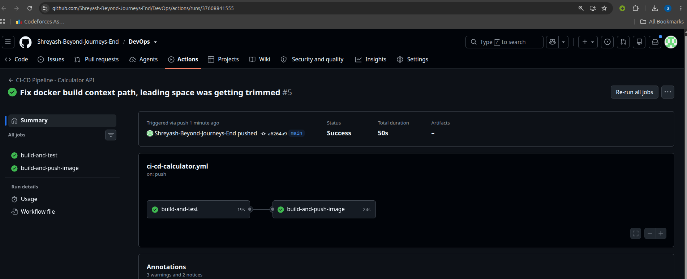
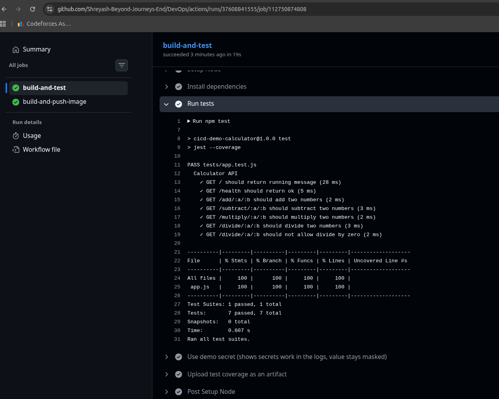
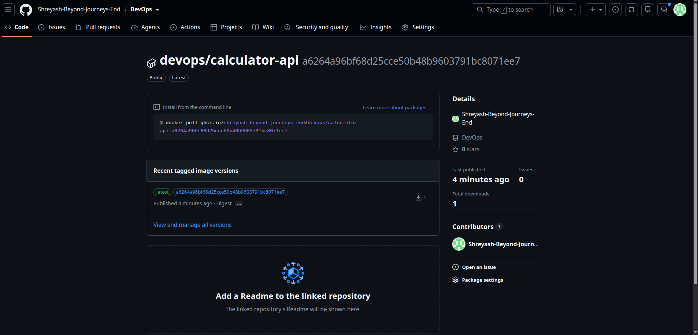

# CI/CD Demo Project - Calculator API

This is my homework for Session 16: CI/CD & GitHub Actions.

The idea of this project is simple: I made a small API, and I built a pipeline
around it using GitHub Actions. Every time I push code, GitHub automatically
builds the app, runs the tests, and then (if everything passes and it is on
the main branch) builds a Docker image and pushes it to GitHub Container
Registry.

## What is CI and CD

- **CI (Continuous Integration)**: Every time I push code, it automatically
  gets built and tested. This way I catch bugs early, instead of finding out
  later that something is broken.
- **CD (Continuous Delivery)**: After the code passes CI, it automatically
  gets packaged (as a Docker image here) and pushed somewhere it can be used.
  In a real project this would then be deployed to a server.

## The App

A tiny calculator REST API made with Node.js and Express.

Routes:

| Route | What it does |
|---|---|
| `GET /` | Just says the API is running |
| `GET /health` | Health check |
| `GET /add/:a/:b` | Adds two numbers |
| `GET /subtract/:a/:b` | Subtracts two numbers |
| `GET /multiply/:a/:b` | Multiplies two numbers |
| `GET /divide/:a/:b` | Divides two numbers (blocks divide by zero) |

Tests are written with Jest + Supertest, in `tests/app.test.js`.

## Project Structure

This homework folder sits inside my bigger `DevOps` repo (which has a folder
per session). Because of that, the workflow file itself lives at the **root**
of the repo, not inside this folder - GitHub only looks for workflows in
`.github/workflows` at the repo root.

```
DevOps/                              (repo root)
├── .github/
│   └── workflows/
│       └── ci-cd-calculator.yml      # the GitHub Actions pipeline
└── CI_CD&GitHub_Actions/            (this folder)
    ├── src/
    │   ├── app.js                   # express app + routes
    │   └── index.js                 # starts the server
    ├── tests/
    │   └── app.test.js               # jest tests
    ├── Dockerfile
    ├── .dockerignore
    └── package.json
```

The workflow only triggers when something changes inside this folder, using
a `paths` filter, so it doesn't run for my other homework folders.

## Running it locally

```bash
npm install
npm test        # runs the tests
npm start        # starts the server on port 3000
```

Or with Docker:

```bash
docker build -t cicd-demo-calculator .
docker run -p 3000:3000 cicd-demo-calculator
```

## The GitHub Actions Pipeline

The workflow file is at `.github/workflows/ci-cd-calculator.yml` (repo root).
It runs on every push and pull request to `main` that touches this folder.
It has two jobs:

### Job 1: `build-and-test` (this is the CI part)

- Checks out the code
- Sets up Node.js
- Installs dependencies
- Runs the test suite
- Uploads the test coverage report as a **build artifact**, so I can download
  and check it later from the Actions tab
- Also reads a repo **secret** called `DEMO_SECRET` just to show how secrets
  work in a workflow (GitHub automatically hides the real value in the logs)

### Job 2: `build-and-push-image` (this is the CD part)

This job only runs after Job 1 passes, and only when the push is on `main`.

- Logs in to GitHub Container Registry (`ghcr.io`) using the built-in
  `GITHUB_TOKEN` **secret** - no password typed anywhere
- Builds the Docker image from the `Dockerfile`
- Pushes the image tagged as `latest` and also with the commit SHA

### Some GitHub Actions terms (explained for myself)

- **Workflow** - the whole automation defined in the yml file
- **Job** - a group of steps that runs on one runner (I have 2 jobs)
- **Step** - one single task inside a job, like "run tests"
- **Runner** - the machine (`ubuntu-latest` here) that GitHub spins up to run my job
- **Secret** - a value like a token/password that is stored safely in the repo
  settings, never shown in plain text in the logs
- **Artifact** - a file produced by the pipeline that I can download later,
  for example my coverage report

## How to set this up on your own repo

1. Push this project to a GitHub repo.
2. (Optional) Go to Settings -> Secrets and variables -> Actions, and add a
   secret named `DEMO_SECRET` with any text value, just to see the secret
   step work.
3. Push to `main`. Go to the **Actions** tab and watch the pipeline run.
4. Once the CD job finishes, the image will show up under
   **Packages** on your GitHub profile/repo, as
   `ghcr.io/<your-username>/<repo-name>/calculator-api`.

## Screenshots

These are from my own run of the pipeline on GitHub.

### CI job passing (tests running)


### Full pipeline, both jobs green


### Docker image pushed to GitHub Container Registry

