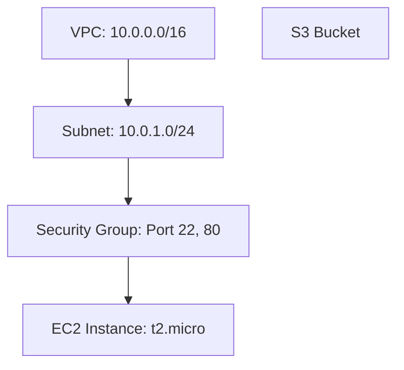
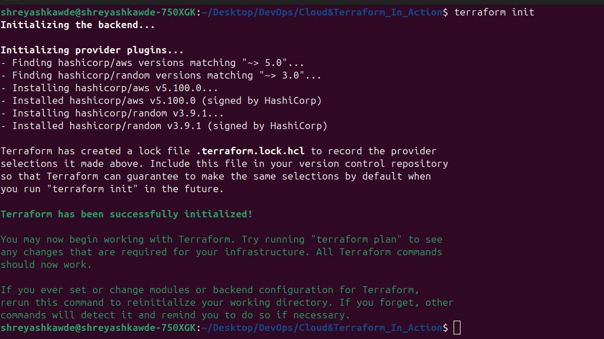
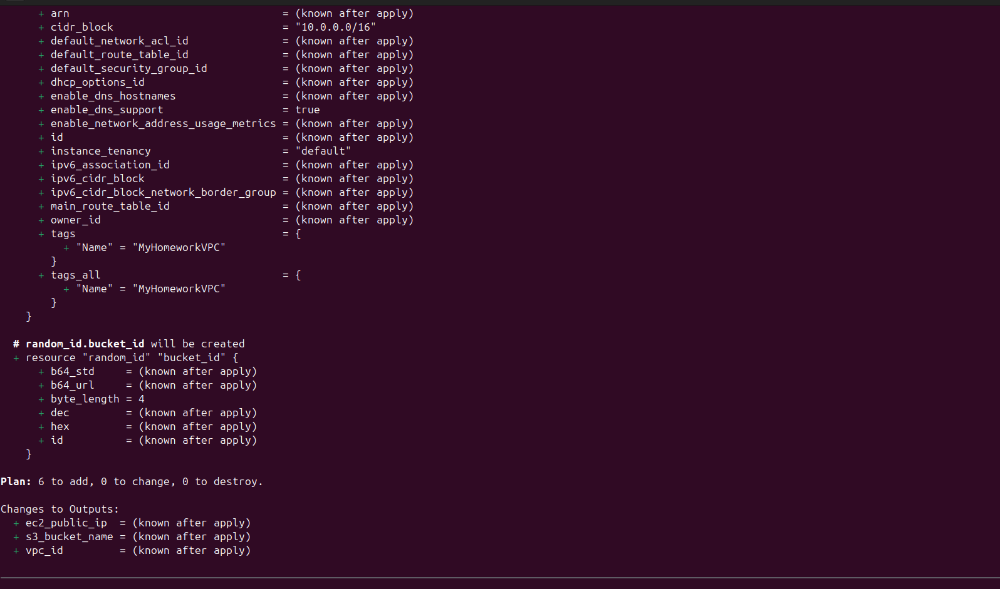
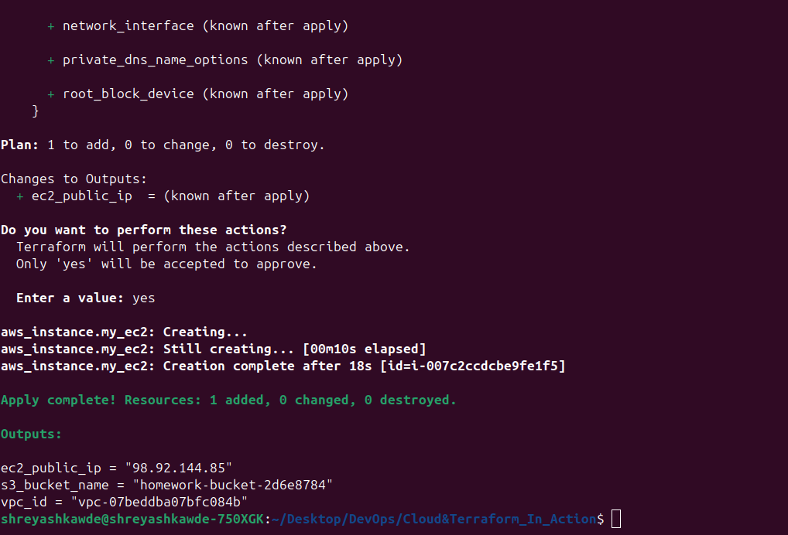
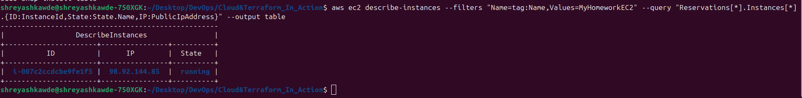
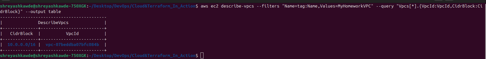
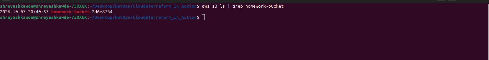
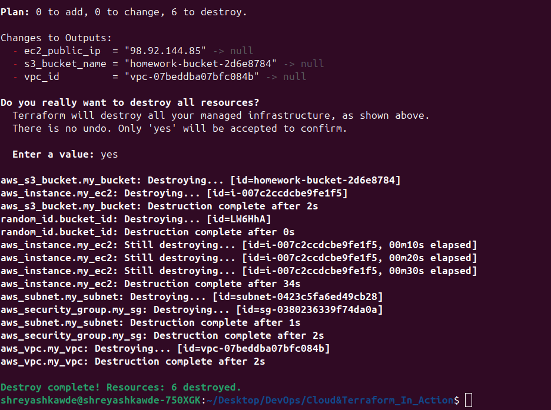

# Cloud & Terraform Infrastructure Project

This is my homework project for Session 19: Cloud & Terraform in Action. It builds an end-to-end cloud infrastructure on AWS using Terraform.

## What This Project Does

This Terraform project automatically creates the following AWS resources:
* **VPC**: A virtual network.
* **Subnet**: A subdivision of the VPC.
* **Security Group**: Firewall rules to allow SSH and HTTP traffic.
* **EC2 Instance**: A virtual server running inside the Subnet.
* **S3 Bucket**: Storage for files.

It also uses different Terraform features like providers, variables, resources, outputs, and dependencies.

## Architecture Diagram

Here is how the resources are connected:



## How to Run It

You need to have Terraform installed and your AWS credentials configured on your machine.
Then, open your terminal in this folder and run these commands in order:

1. **Initialize Terraform:** Downloads the needed providers.
   ```bash
   terraform init
   ```

2. **Plan the changes:** Shows you what resources will be created.
   ```bash
   terraform plan
   ```

3. **Apply the changes:** Actually creates the resources on AWS. (Type `yes` when asked).
   ```bash
   terraform apply
   ```

4. **Clean up (When you are done):** Deletes all the resources so you don't get charged by AWS. (Type `yes` when asked).
   ```bash
   terraform destroy
   ```

## Project Execution Screenshots

Below is the evidence of the infrastructure creation and teardown:

### 1. Terraform Init


### 2. Terraform Plan


### 3. Terraform Apply


### 4. AWS CLI - EC2 Instance Created


### 5. AWS CLI - VPC Created


### 6. AWS CLI - S3 Bucket Created


### 7. Terraform Destroy

