# Session 17: Complete CI/CD & DevSecOps

A small Node.js calculator API with a full CI/CD + DevSecOps pipeline on GitHub Actions.
Every push to `main` goes through build, tests, four security checks and a security gate
before the image is pushed to GHCR and deployed to Kubernetes.

## Pipeline flow

```
Code -> Build -> Unit Test -> SAST -> SCA -> Secret Scan -> Docker Build
     -> Container Image Scan -> Security Gate -> Push Image -> Deploy to Kubernetes
```

| Stage | Tool | Job in `.github/workflows/devsecops-pipeline.yml` |
|---|---|---|
| Build + unit test | npm, Jest + Supertest | `build-and-test` |
| SAST | Semgrep (`p/javascript` + my own rule in `security/semgrep-rules.yml`) | `sast-semgrep` |
| SCA | `npm audit --omit=dev --audit-level=high` | `sca-npm-audit` |
| Secret scan | Gitleaks (`security/.gitleaks.toml`) | `secret-scan-gitleaks` |
| Docker build + image scan | Docker Buildx, Trivy (HIGH/CRITICAL fail the build) | `docker-build-and-scan` |
| Security gate | `needs:` on all four scans | `security-gate` |
| Push image | GitHub Container Registry (GHCR) | `push-image` |
| Deploy | `kind` cluster on the runner + `kubectl apply` + smoke test | `deploy-k8s` |

SAST, SCA, secret scan and the image build/scan run in parallel after the tests pass. If any of
them fails, `security-gate` is skipped and nothing is pushed or deployed. The push job uploads
the exact image tarball that Trivy scanned, so what is scanned is what ships.

The push and deploy jobs only run on pushes to `main`. Pull requests stop at the security gate.

## Project layout

```
src/            Express app (app.js) and server entry (index.js)
tests/          Jest + Supertest unit tests (100% coverage)
Dockerfile      node:20-alpine, non-root user, npm removed from the final image
k8s/            namespace, deployment (2 replicas, probes, limits), NodePort service
security/       semgrep-rules.yml (custom rule), .gitleaks.toml, .trivyignore
screenshots/    evidence of the pipeline and local runs
```

The workflow file itself lives at the repository root, `.github/workflows/devsecops-pipeline.yml`,
because GitHub only reads workflows from there.

## API

| Route | Example | Result |
|---|---|---|
| `GET /` | | `{"message":"Calculator API is running"}` |
| `GET /health` | | `{"status":"ok"}` |
| `GET /add/:a/:b` | `/add/2/3` | `{"result":5}` |
| `GET /subtract/:a/:b`, `/multiply/:a/:b`, `/divide/:a/:b` | | `{"result":...}`; dividing by zero gives 400 |

## Run it locally

```bash
npm install
npm test                    # unit tests + coverage
npm start                   # http://localhost:3000

docker build -t devsecops-calculator:local .
docker run -p 3000:3000 devsecops-calculator:local
```

Security tools locally:

```bash
semgrep scan --config p/javascript --config security/semgrep-rules.yml --error src tests
npm audit --omit=dev --audit-level=high
gitleaks detect --source . --no-git --config security/.gitleaks.toml --redact
trivy image --severity HIGH,CRITICAL --ignore-unfixed devsecops-calculator:local
```

Kubernetes (minikube):

```bash
minikube image load devsecops-calculator:local
kubectl apply -f k8s/          # edit the image in k8s/deployment.yaml to the local tag first
kubectl get pods,svc -n devsecops-demo
curl $(minikube ip):30090/add/2/3
```

## Security gate decisions

- **SCA only checks production dependencies.** `npm audit` reports many high findings in Jest's
  dev dependency tree, but those never ship in the image, so the gate uses `--omit=dev`.
  Production dependencies currently have 0 vulnerabilities.
- **Image scan found real issues first, and I fixed them** rather than ignoring them:
  1. npm's bundled `node-tar` had several HIGH CVEs. The runtime image does not need npm, so the
     Dockerfile deletes it after `npm install`.
  2. Alpine's `openssl` (libcrypto3/libssl3) had HIGH CVEs with fixes available. The Dockerfile
     now runs `apk upgrade`.
  After both changes Trivy reports 0 HIGH/CRITICAL findings.
- **Custom SAST rule:** `no-eval` in `security/semgrep-rules.yml` fails the build if `eval()` is used.
- The container runs as the non-root `node` user.

## Screenshots

Local runs of each stage (`screenshots/`):

| Stage | File |
|---|---|
| Unit tests | `01-unit-tests.png` |
| SAST (Semgrep) | `02-sast-semgrep.png` |
| SCA (npm audit) | `03-sca-npm-audit.png` |
| Secret scan (Gitleaks) | `04-secret-scan-gitleaks.png` |
| Docker build + image scan (Trivy) | `05-docker-build-image-scan.png` |
| Kubernetes deployment | `06-k8s-deployment.png` |

Successful GitHub Actions run (all 8 jobs green, 3m 28s):

| Evidence | File |
|---|---|
| Full pipeline graph | `pipeline-01-success-graph.png` |
| Security gate log | `pipeline-02-security-gate.png` |
| Trivy image scan step | `pipeline-03-trivy-scan.png` |
| Kubernetes deploy (rollout + pods/service) | `pipeline-04-k8s-deploy.png` |
| Smoke test against the deployed service | `pipeline-05-smoke-test.png` |
| Image published in GHCR | `pipeline-06-ghcr-package.png` |

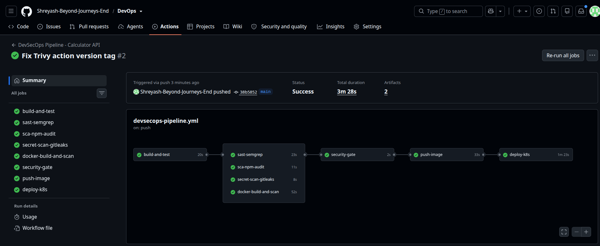
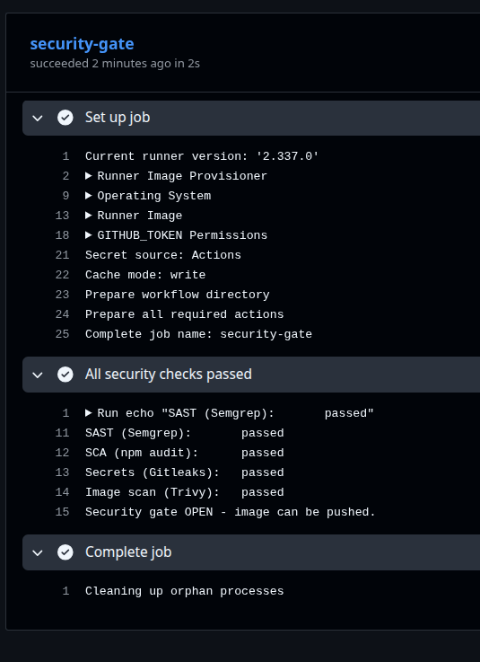
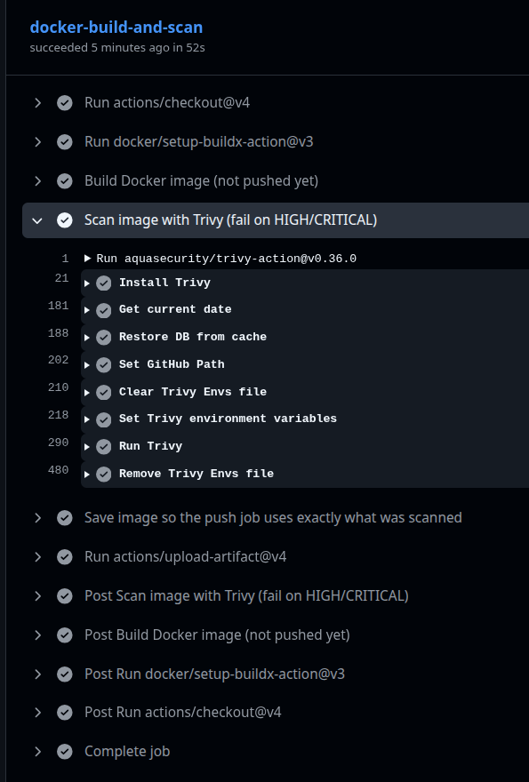
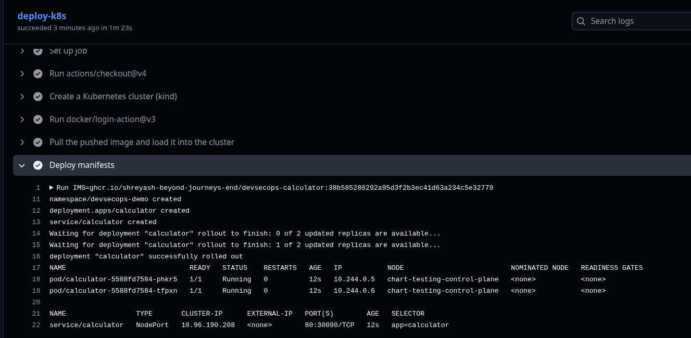
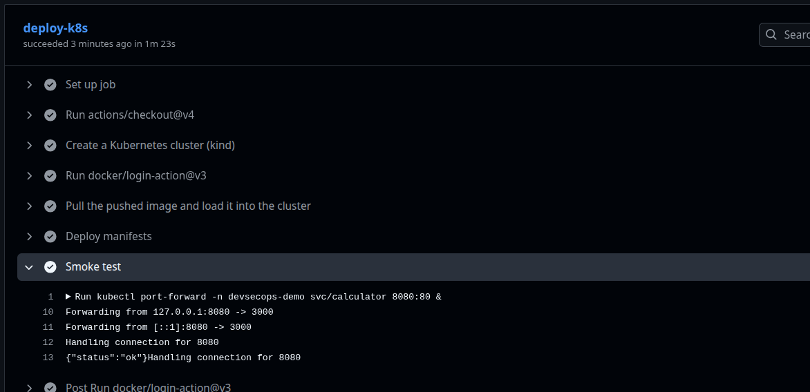
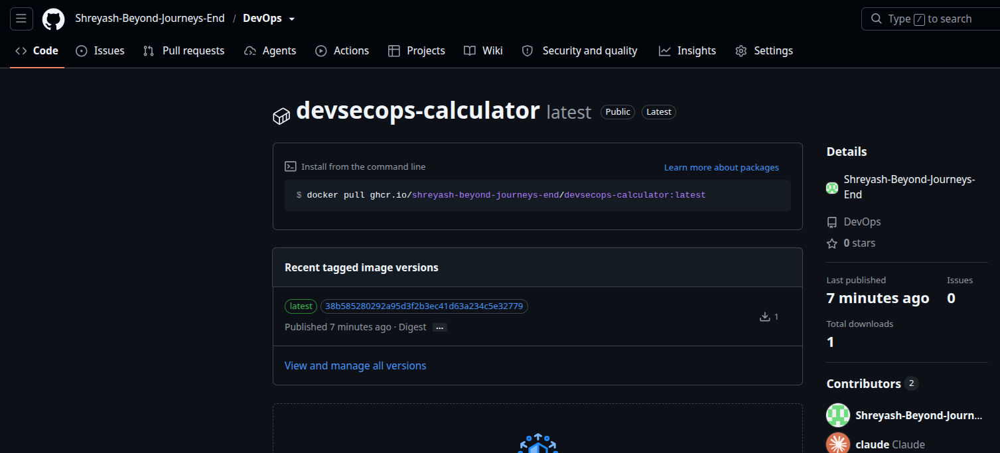

Local runs:

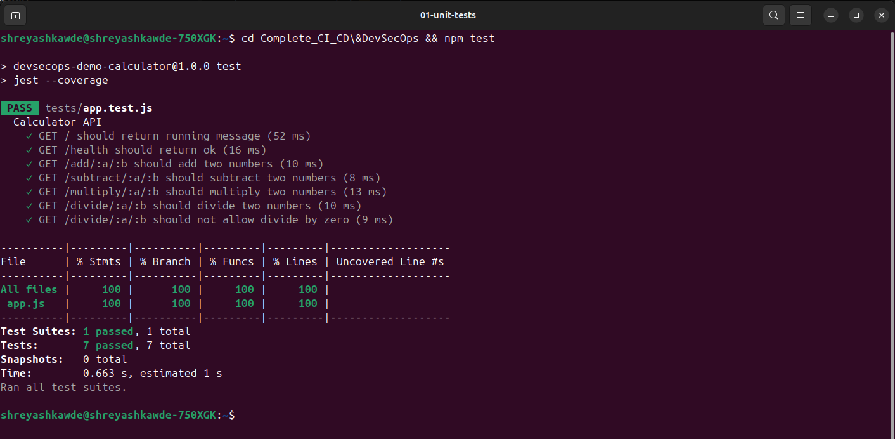
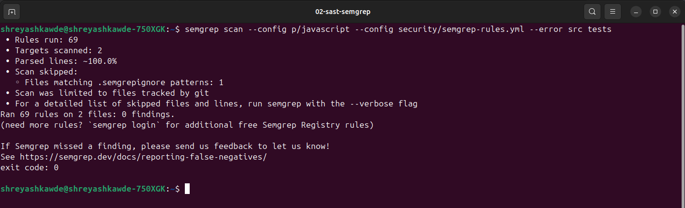
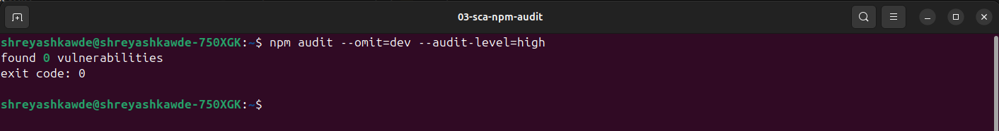
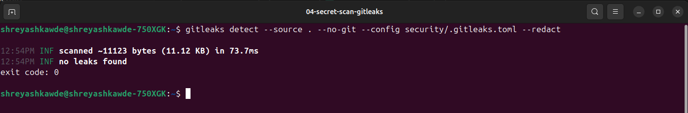
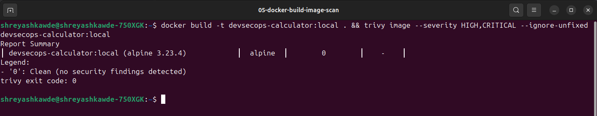
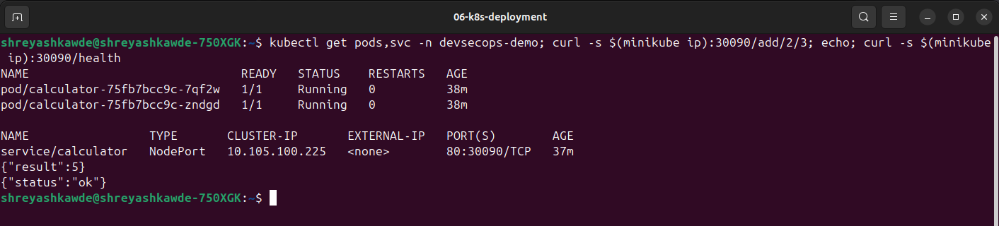
