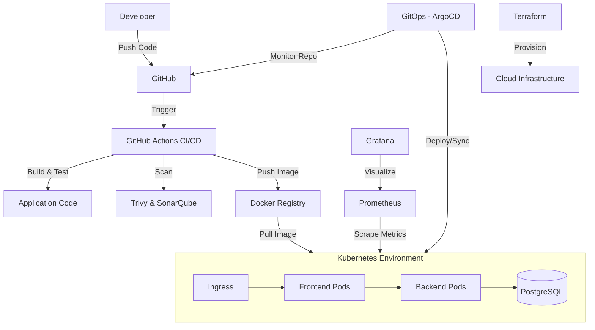
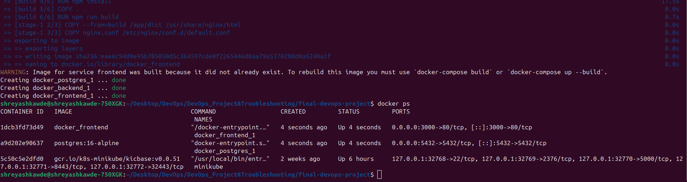
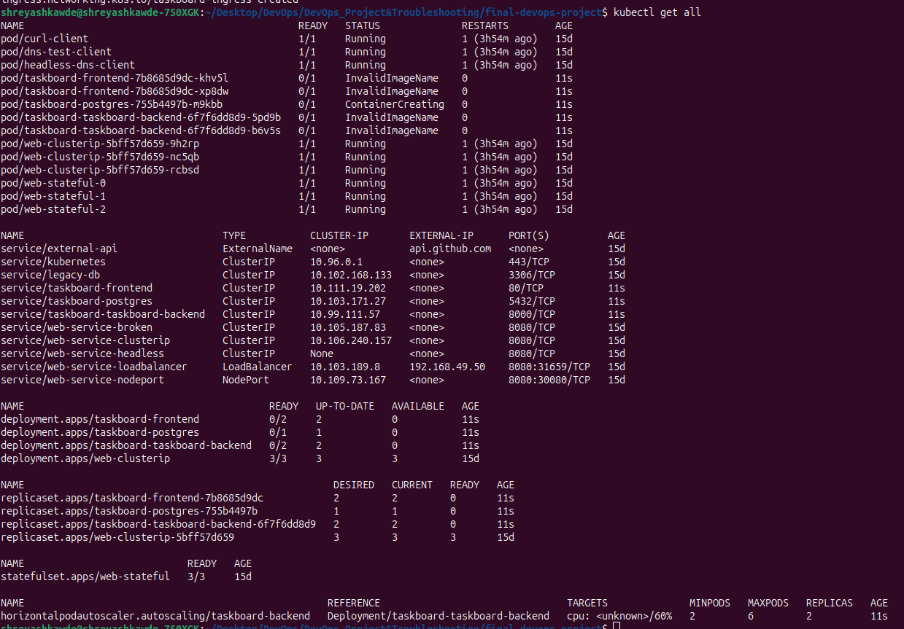
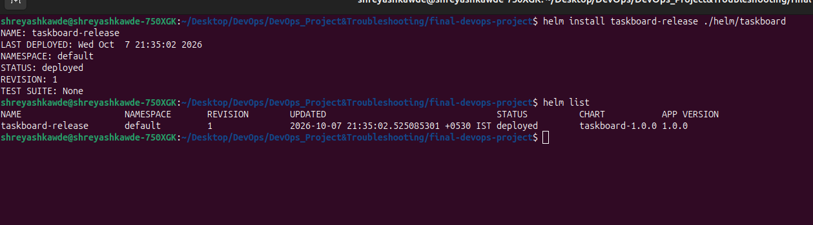
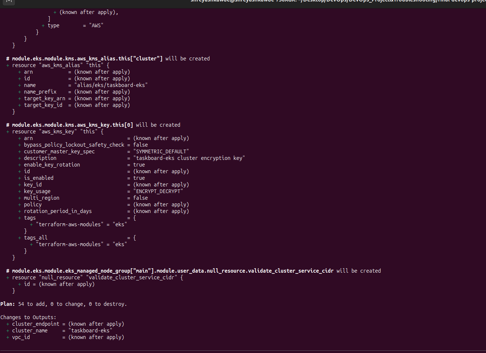
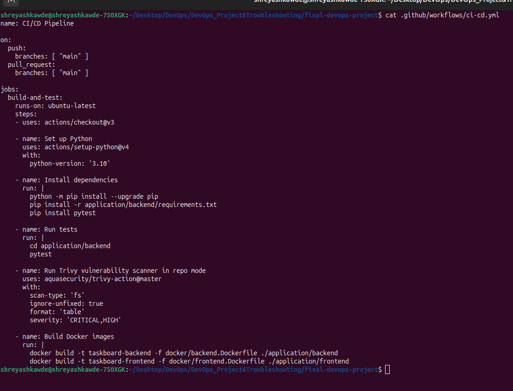
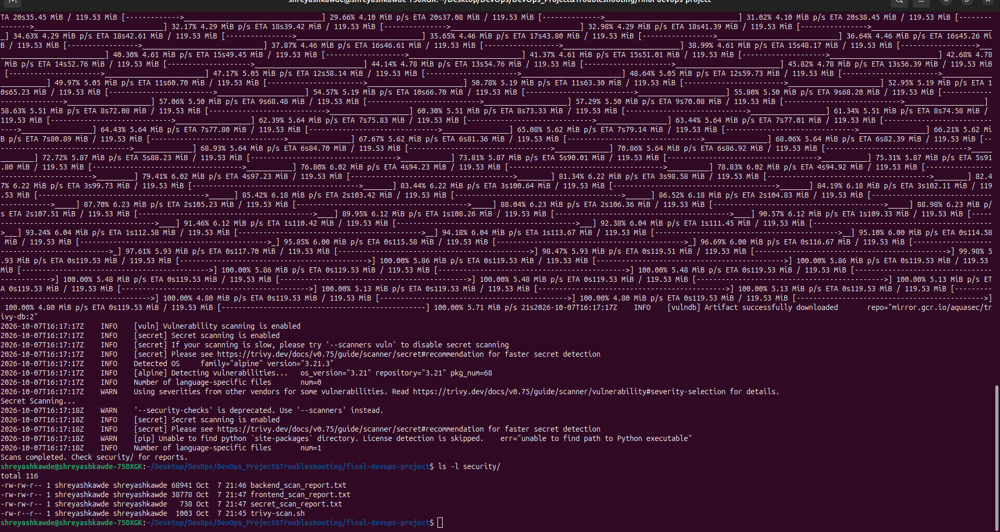
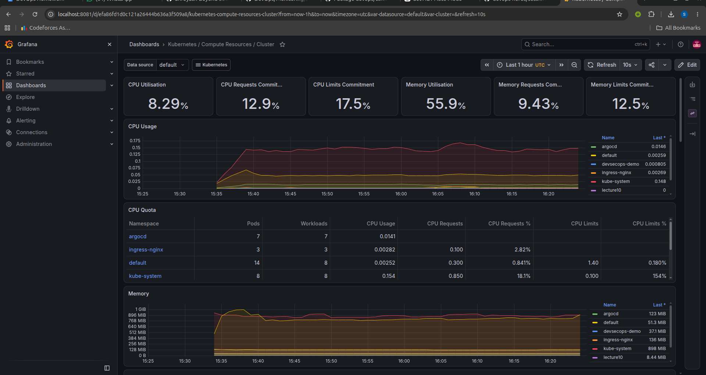
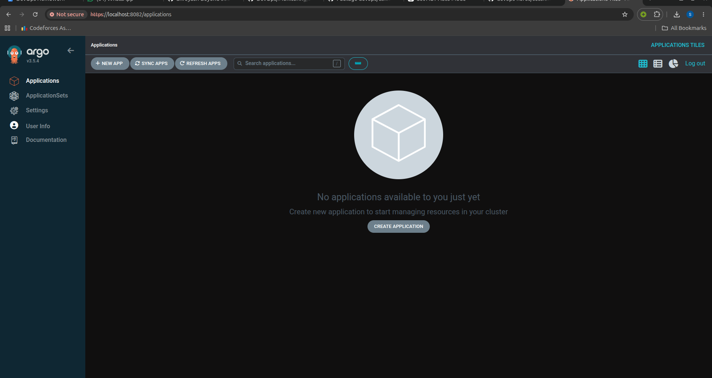

# Final DevOps Project & Troubleshooting

## Project Overview
This project is an end-to-end DevOps pipeline and infrastructure setup for a simple Taskboard application. It includes both frontend and backend components. We use Docker to containerize the app, Terraform to provision the infrastructure, Kubernetes and Helm to deploy it, and GitHub Actions for our CI/CD pipeline. We also implemented security checks, monitoring, and a GitOps workflow using ArgoCD.

## Architecture Diagram

## Technologies Used
- **Application:** Python (Backend), React/HTML/JS (Frontend)
- **Containerization:** Docker, Docker Compose
- **Orchestration:** Kubernetes
- **Package Manager:** Helm
- **Infrastructure as Code:** Terraform
- **CI/CD:** GitHub Actions
- **Security:** Trivy (SAST/SCA/Container Scanning)
- **Monitoring:** Prometheus, Grafana
- **GitOps:** ArgoCD

## Application Setup
The application consists of two parts:
1. A Python backend that handles the API and connects to a PostgreSQL database.
2. A frontend that serves the user interface.

To run it locally without Docker:
- Go to `application/backend`, install `requirements.txt`, set up a local Postgres DB, and run the app.
- Go to `application/frontend` and open `index.html` or run via a simple web server.

## Docker Setup
I have created Dockerfiles for both frontend and backend. 
- `docker/backend.Dockerfile`: Uses a python base image, installs requirements, and runs the backend app.
- `docker/frontend.Dockerfile`: Uses an Nginx base image to serve the frontend files.
- `docker/docker-compose.yml`: Can be used to spin up the frontend, backend, and database together on a local machine for testing.

**Screenshot (Docker Setup):**

## Kubernetes Deployment
I created raw Kubernetes manifests located in the `kubernetes/` folder. This includes:
- Deployments for frontend, backend, and postgres.
- Services for internal communication.
- A Secret and PersistentVolumeClaim for the database.
- An Ingress for external access.
- A HorizontalPodAutoscaler (HPA) to scale the backend based on CPU usage.

**Screenshot (Kubernetes Deployment):**

## Helm Deployment
A Helm chart is created in the `helm/taskboard` directory. This allows for easier parameterization of our deployments (e.g., changing image tags, replicas, or database credentials) through the `values.yaml` file.

**Screenshot (Helm Deployment):**

## Terraform Infrastructure
Terraform is used to provision the underlying infrastructure. The configurations are in the `terraform/` folder. It sets up the VPC, subnets, and an EKS cluster (or similar managed K8s service).

**Screenshot (Terraform Infrastructure):**

## CI/CD Pipeline
The pipeline is defined in `.github/workflows/ci-cd.yml`. It automatically triggers on a push or pull request to the main branch. 
Steps included:
1. Checks out the code.
2. Sets up Python and installs dependencies.
3. Runs tests using pytest.
4. Scans the code with Trivy.
5. Builds the Docker images.

**Screenshot (CI/CD Pipeline):**

## DevSecOps Implementation
Security is integrated into our workflow:
- **SAST & SCA:** We use Trivy in the CI pipeline to scan the filesystem for vulnerabilities and exposed secrets.
- **Container Scanning:** A script `security/trivy-scan.sh` is provided to scan our built Docker images for critical and high vulnerabilities before they are deployed.

**Screenshot (DevSecOps):**

## Monitoring
We integrated monitoring using the kube-prometheus-stack. 
- A `ServiceMonitor` is included in the Kubernetes manifests so Prometheus can scrape metrics from our backend application.
- The `monitoring/` folder contains dashboards and configurations to visualize the health of our cluster and application.

**Screenshot (Monitoring):**

## GitOps
For continuous deployment, we use ArgoCD. The application manifest is located at `gitops/argocd-app.yaml`. This tells ArgoCD to watch our repository and automatically apply changes to the Kubernetes cluster when the code is updated.

**Screenshot (GitOps):**

## Troubleshooting

### Issue 1: Database Connection Failure
**Identifying the issue:** After deploying to Kubernetes, the backend pods were crashing continuously. `kubectl get pods` showed `CrashLoopBackOff`.
**Investigation:** I checked the logs using `kubectl logs <backend-pod-name>`. The logs showed an error: `psycopg2.OperationalError: FATAL: password authentication failed for user "taskboard"`.
**Root cause:** The `DATABASE_URL` environment variable in `kubernetes/backend-deployment.yaml` was hardcoded with a wrong password instead of matching the one in the Secret.
**Fix:** I updated the backend deployment to reference the correct secret values or updated the connection string to match the deployed secret.
**Verification:** Deleted the failing pods and waited for new ones. `kubectl get pods` showed `Running` and the logs showed successful connection.

### Issue 2: Frontend 502 Bad Gateway
**Identifying the issue:** When trying to access the app via the Ingress URL, the frontend loaded but API calls returned a 502 error.
**Investigation:** Checked the Nginx configuration in the frontend and the frontend pod logs. 
**Root cause:** The frontend Nginx proxy was pointing to `http://localhost:8000` instead of the backend service name `http://taskboard-taskboard-backend:8000`.
**Fix:** Modified the `proxy_pass` in the Nginx config to point to the correct Kubernetes service DNS.
**Verification:** Rebuilt the frontend image, updated the deployment, and refreshed the browser. The API calls succeeded.

## Lessons Learned
1. **Automation is key:** Setting up CI/CD and GitOps takes time initially but saves countless hours during development.
2. **Security early:** Catching vulnerabilities during the build process using Trivy is much easier than fixing them in production.
3. **Logs are your best friend:** When troubleshooting K8s issues, always start with `kubectl describe` and `kubectl logs`. They usually tell you exactly what is wrong.
4. **Infrastructure as Code:** Using Terraform made it incredibly easy to tear down and recreate my environments without manually clicking through a cloud console.
