# Docker Fundamentals Homework


## 1. Node.js Application
A simple Node.js application using Express to serve a "Hello World" message.

**How to run:**
```bash
cd nodejs-app
docker build -t nodejs-hello-world .
docker run -p 3000:3000 nodejs-hello-world
```
Go to `http://localhost:3000` in your browser.

**Screenshots:**
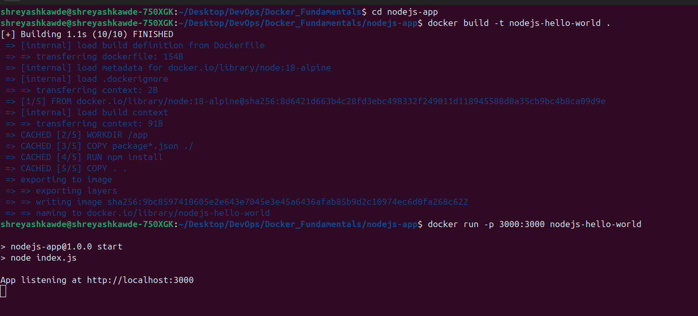
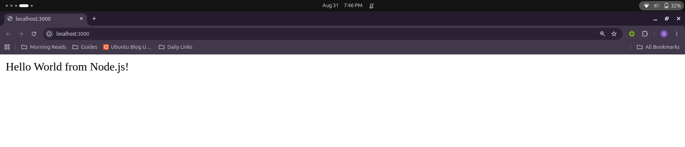

---

## 2. Python Application
A lightweight Python application using Flask.

**How to run:**
```bash
cd python-app
docker build -t python-hello-world .
docker run -p 5000:5000 python-hello-world
```
Go to `http://localhost:5000` in your browser.

**Screenshots:**
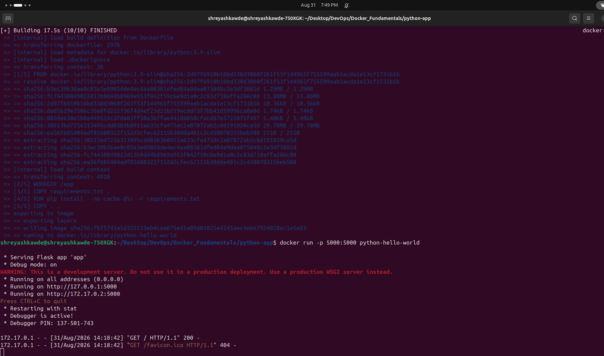
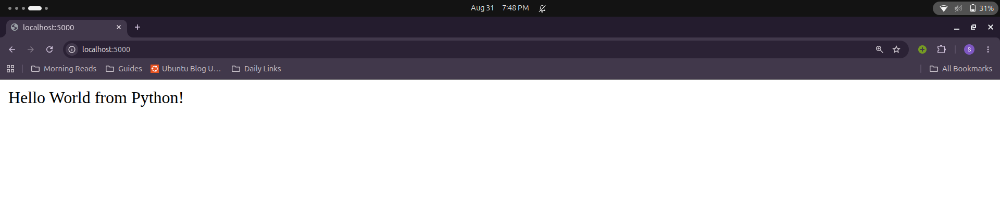

---

## 3. Java Application
A minimal Java web server using `com.sun.net.httpserver.HttpServer`.

**How to run:**
```bash
cd java-app
docker build -t java-hello-world .
docker run -p 8080:8080 java-hello-world
```
Go to `http://localhost:8080` in your browser.

**Screenshots:**
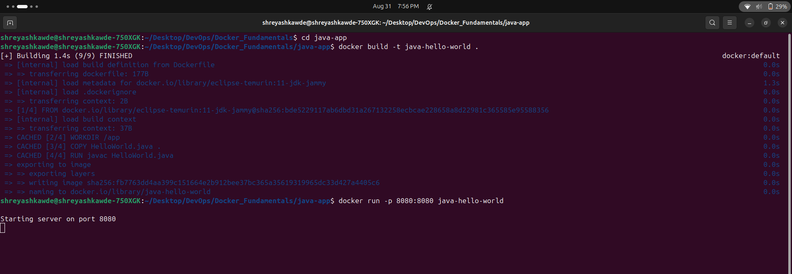
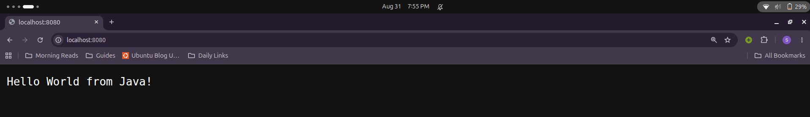

---

## 4. Apache Web Server
A basic Apache HTTP server serving a static HTML page.

**How to run:**
```bash
cd apache-app
docker build -t apache-hello-world .
docker run -p 8081:80 apache-hello-world
```
Go to `http://localhost:8081` in your browser.

**Screenshots:**
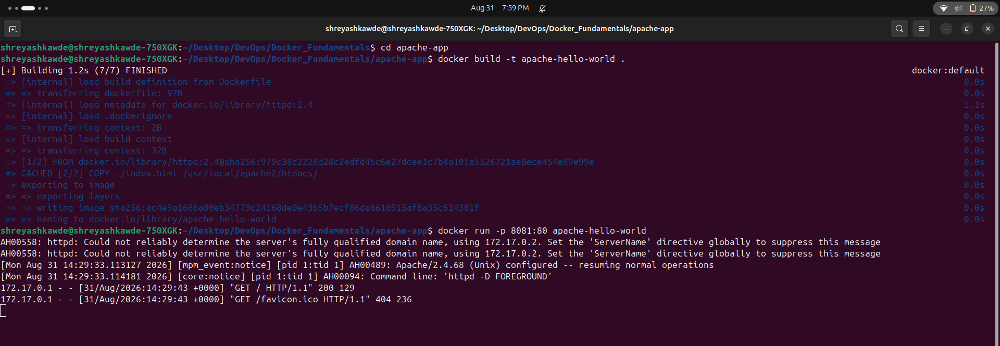
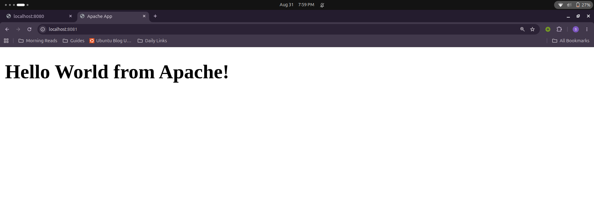

---

## 5. React Application
A simple React application created using create-react-app serving a "Hello World" message.

**How to run:**
```bash
cd React-app
docker build -t react-hello-world .
docker run -p 3001:3000 react-hello-world
```
Go to `http://localhost:3001` in your browser.

**Screenshots:**
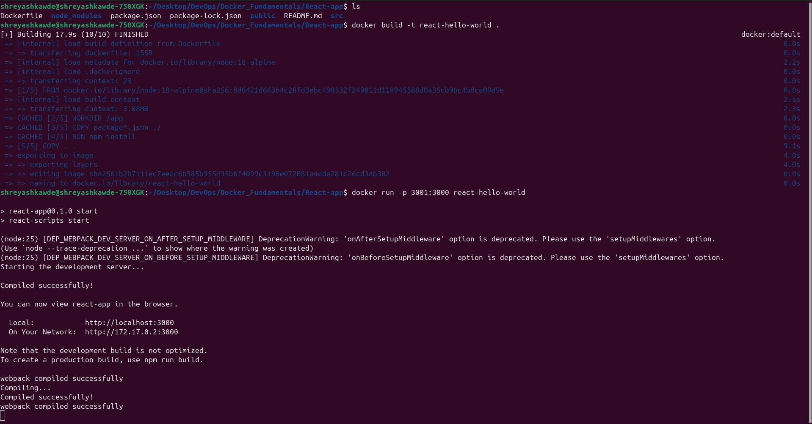
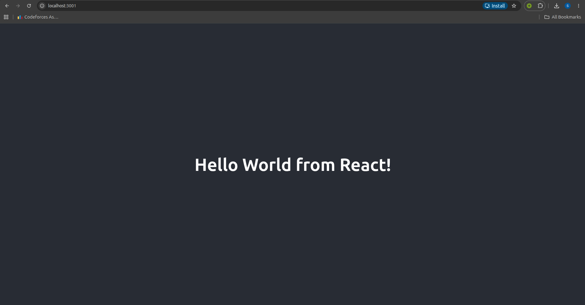

---

## 6. Nginx Application
A basic Nginx server serving a static HTML page.

**How to run:**
```bash
cd nginx-app
docker build -t nginx-hello-world .
docker run -p 8082:80 nginx-hello-world
```
Go to `http://localhost:8082` in your browser.

**Screenshots:**
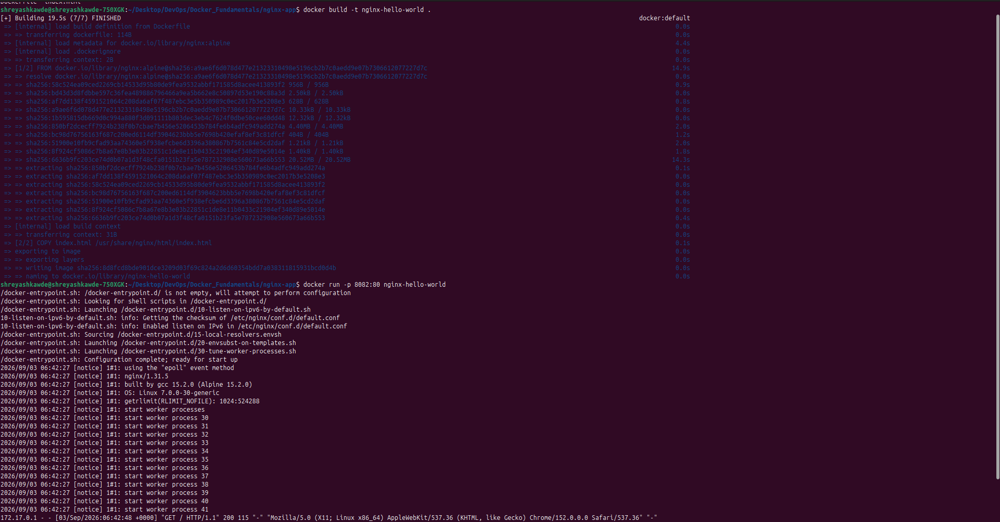
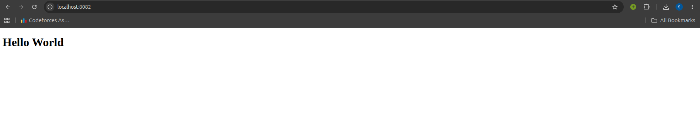
