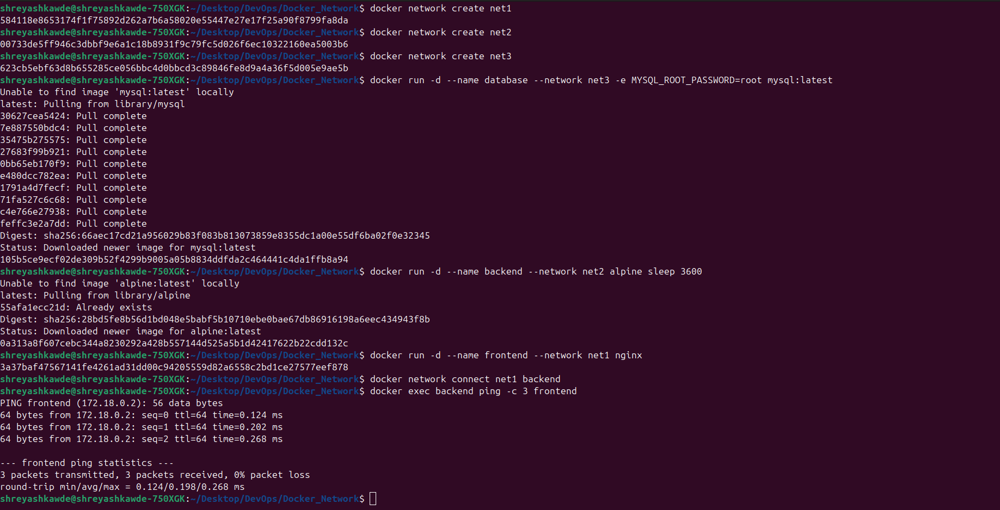
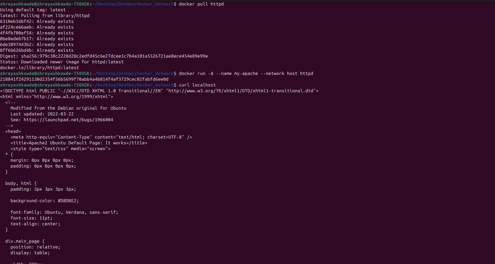

# Docker Networking & Volume Homework

## Task 1: Docker Container Networking

I created 3 containers (Frontend, Backend, Database) and 3 networks. 
I put the frontend in `net1`, the database in `net3`, and the backend in `net2`. Then I added the backend to `net1` so it could talk to the frontend.

**Containers created:**
- Frontend: nginx
- Backend: alpine
- Database: mysql

**Networks created:** `net1`, `net2`, `net3`

*Connectivity Test:* The backend container was successfully able to ping the frontend container since they share `net1`.

## Task 2: Host Network

I pulled the apache2 image (`httpd`) and ran it using the host network. 
I was able to access the apache website directly on localhost port 80.

## Task 3: Bind Mount

I created a local folder with an `index.html` file inside it saying "Hello students". I attached this folder to a new nginx container using a bind mount. 
After checking the website, I modified the file on my local machine and refreshed the page. The changes updated automatically without restarting the container.

## Task 4: Overlay Network

**What is an Overlay Network?**
A Docker overlay network is a type of network that allows multiple Docker hosts to connect with each other. It creates a distributed network across multiple different machines running Docker.

**Use Cases:**
It is mostly used for Docker Swarm or Kubernetes clusters where you have containers running on different physical servers or virtual machines that need to talk to each other securely as if they were on the same local network.

**How it works across multiple hosts:**
It works by wrapping the container network traffic in a special packet (VXLAN) and sending it over the physical network to the other Docker host. The receiving host unpackages it and sends it to the correct container. This hides the underlying physical network from the containers.
