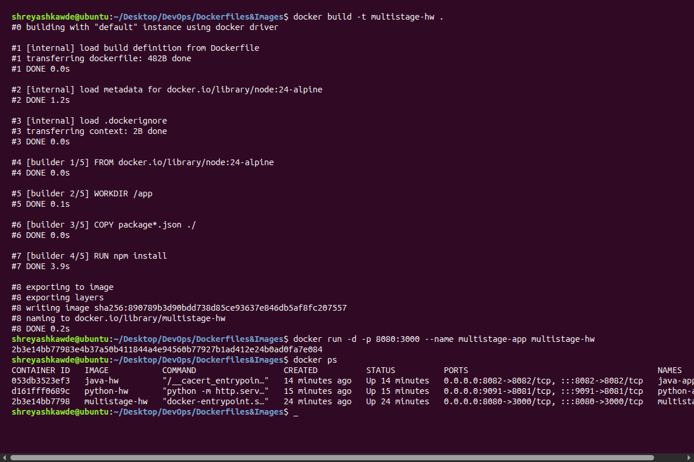
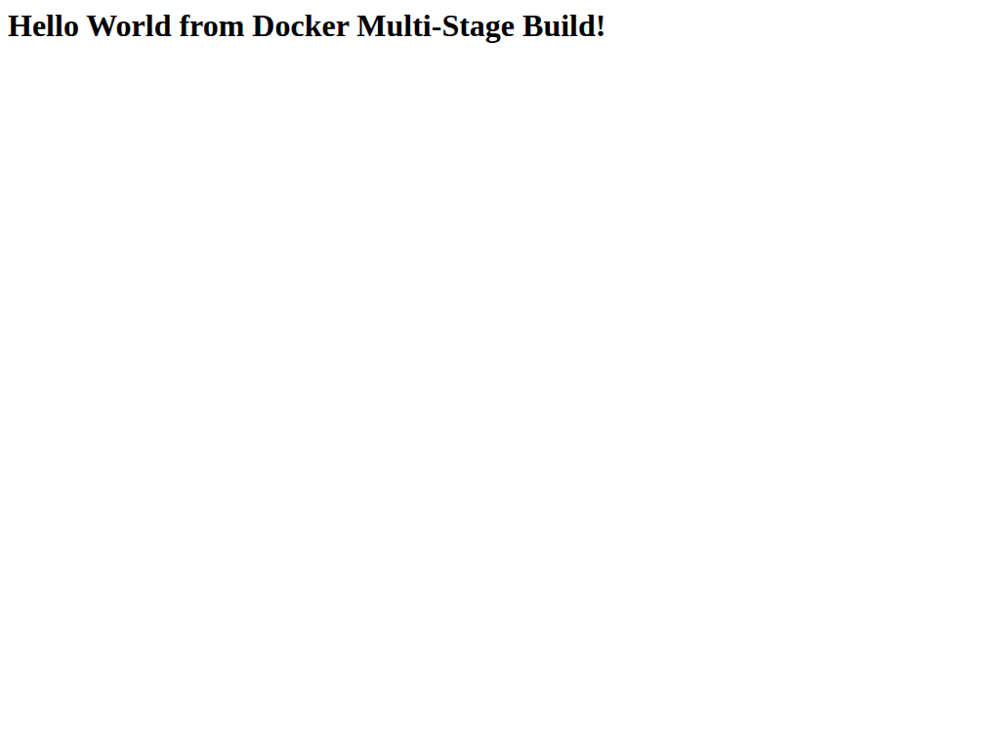
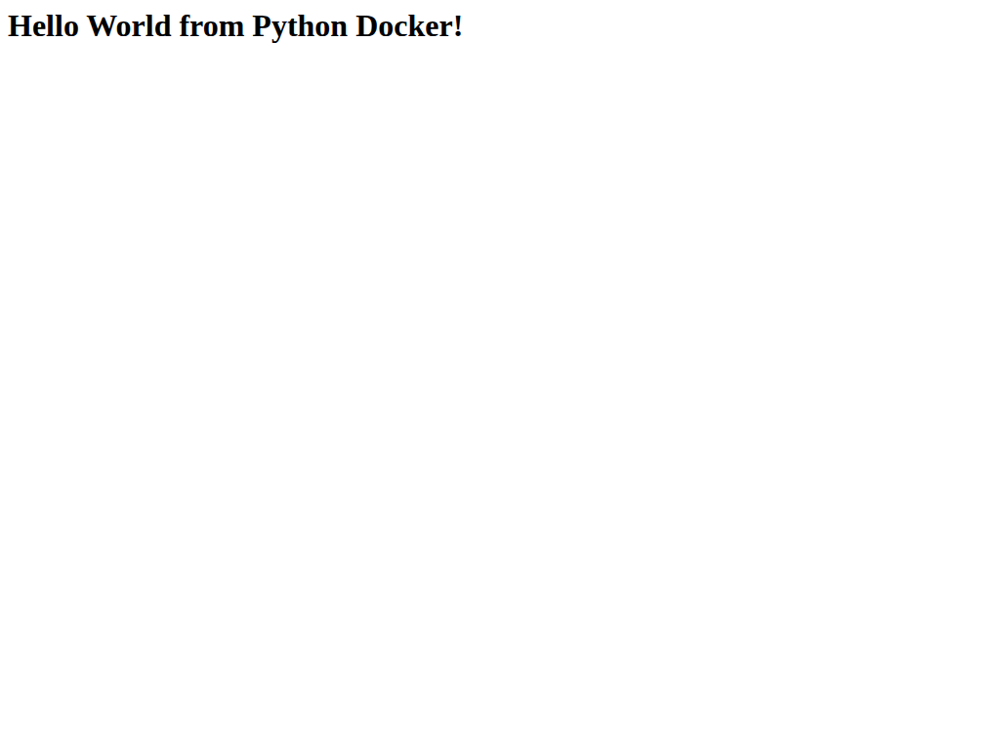
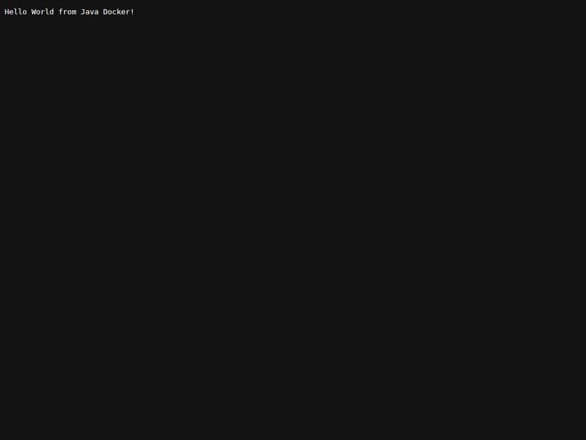

# Docker Applications Homework

**Name:** Shreyash Sukhadev Kawde  
**Enrollment Number:** 10253

## Task 1 & 2: Multi-Stage Node.js Application

### 1. Docker Build, Run, and Container Status
Here is the complete terminal session showing the `docker build`, `docker run`, and `docker ps` commands successfully executing:

### 2. Application Output
Here is the screenshot showing that the Node.js application is running successfully on port 8080:

---

## Task 3: Deploy 3 Different Types of Applications

I have deployed three different types of applications using Docker: Node.js (shown above), Python, and Java.

### Application 2: Python Web Server
The Python app is serving a simple HTML page on port 9091.

**Application Output:**

### Application 3: Java Web Server
The Java app is running a custom HTTP Server on port 8082.

**Application Output:**

