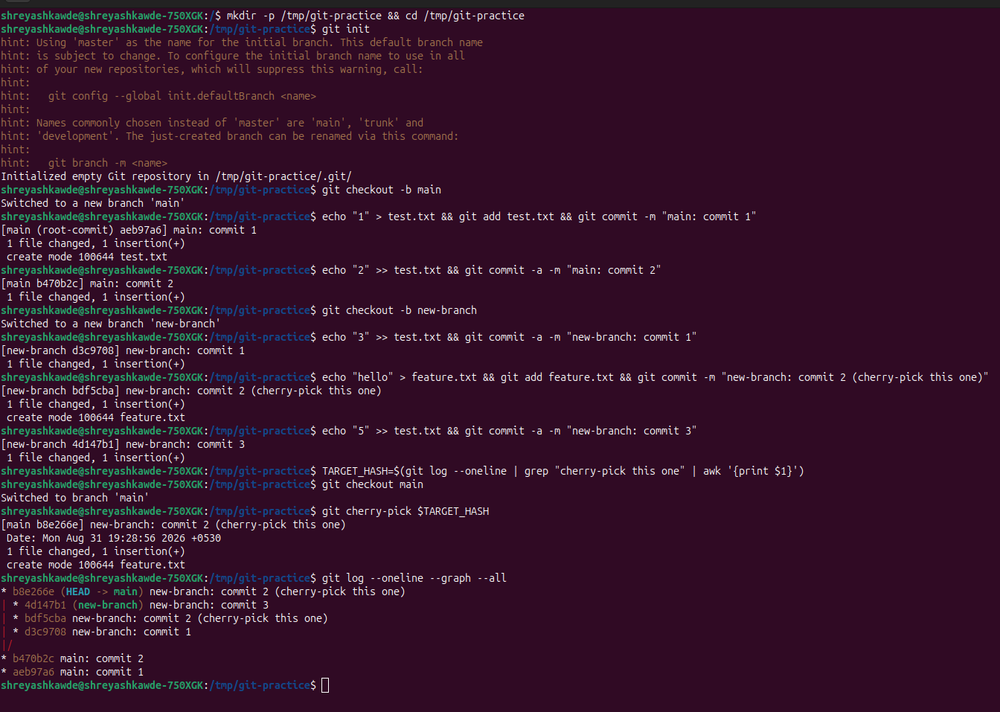

# Git Homework

### 1. `git commit -m` vs `git commit -a -m`

* **`git commit -m "message"`**: This only commits the changes that you have manually added to the staging area using the `git add` command. If you modified a file but didn't `git add` it, this command will ignore it.
* **`git commit -a -m "message"`**: This is a shortcut. The `-a` tells Git to automatically add all the modified and deleted files to the staging area and commit them at the same time. *(Note: This doesn't include completely new files that Git has never seen before).*

### 2. Cherry-Picking Exercise

For this exercise, I created some commits on my `main` branch, made a new branch, added more commits there, and then cherry-picked one specific commit from the new branch back into `main`. 

Here is the screenshot of my terminal showing the commands I ran and the final `git log` proving the cherry-pick worked:

