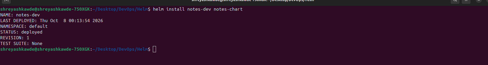
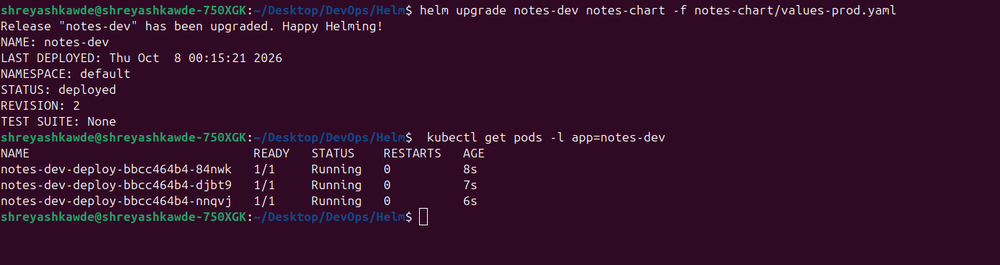
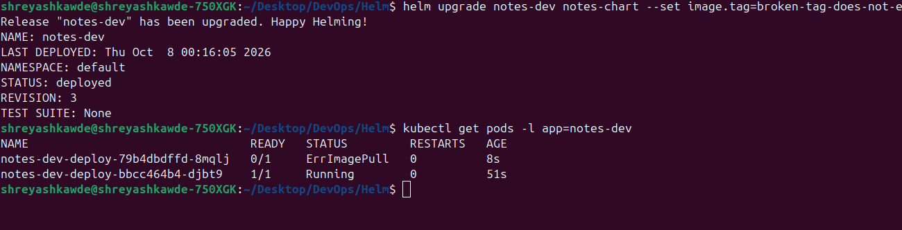
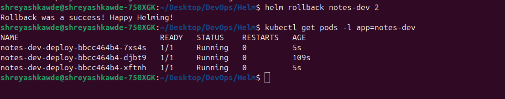
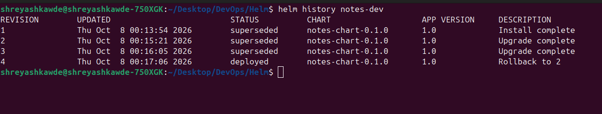

# Helm Mini Project and Homework

This repository contains the homework for Session 15: Helm. 

## Task 1: Helm Commands

Here are the important Helm commands we covered. I ran these commands on my local Minikube cluster and captured the output.

### 1. `helm create`
Creates a new Helm chart with the default directory structure and template files.
**Command:**
```bash
helm create my-demo-chart
```
**Output:**
```
Creating my-demo-chart
```

### 2. `helm install`
Installs a Helm chart on the cluster and creates a new release.
**Command:**
```bash
helm install notes-dev notes-chart
```
**Output:**
```
NAME: notes-dev
LAST DEPLOYED: Thu Oct  8 00:11:02 2026
NAMESPACE: default
STATUS: deployed
REVISION: 1
TEST SUITE: None
```

### 3. `helm list`
Lists all the active releases deployed on the cluster.
**Command:**
```bash
helm list
```
**Output:**
```
NAME             NAMESPACE	REVISION	UPDATED                                	STATUS  	CHART            	APP VERSION
notes-dev        default  	1       	2026-10-08 00:11:02.524839572 +0530 IST	deployed	notes-chart-0.1.0	1.0        
```

### 4. `helm status`
Shows the current status of a specific release.
**Command:**
```bash
helm status notes-dev
```
**Output:**
```
NAME: notes-dev
LAST DEPLOYED: Thu Oct  8 00:11:02 2026
NAMESPACE: default
STATUS: deployed
REVISION: 1
TEST SUITE: None
```

### 5. `helm get`
Downloads extended information about the release, like the generated manifests and computed values.
**Command:**
```bash
helm get all notes-dev
```
**Output:** *(Truncated for simplicity)*
```
NAME: notes-dev
LAST DEPLOYED: Thu Oct  8 00:11:02 2026
NAMESPACE: default
STATUS: deployed
REVISION: 1
CHART: notes-chart
...
```

### 6. `helm upgrade`
Upgrades a release to a new version of a chart or applies new values.
**Command:**
```bash
helm upgrade notes-dev notes-chart -f notes-chart/values-prod.yaml
```
**Output:**
```
Release "notes-dev" has been upgraded. Happy Helming!
NAME: notes-dev
LAST DEPLOYED: Thu Oct  8 00:11:22 2026
NAMESPACE: default
STATUS: deployed
REVISION: 2
TEST SUITE: None
```

### 7. `helm history`
Shows the historical revisions for a specific release.
**Command:**
```bash
helm history notes-dev
```
**Output:**
```
REVISION	UPDATED                 	STATUS    	CHART            	APP VERSION	DESCRIPTION     
1       	Thu Oct  8 00:11:02 2026	superseded	notes-chart-0.1.0	1.0        	Install complete
2       	Thu Oct  8 00:11:22 2026	deployed  	notes-chart-0.1.0	1.0        	Upgrade complete
```

### 8. `helm rollback`
Rolls back a release to a previous revision.
**Command:**
```bash
helm rollback notes-dev 1
```
**Output:**
```
Rollback was a success! Happy Helming!
```

### 9. `helm uninstall`
Deletes a release from the cluster and removes all its resources.
**Command:**
```bash
helm uninstall notes-dev
```
**Output:**
```
release "notes-dev" uninstalled
```

### 10. `helm repo`
Manages chart repositories (add, list, update, remove).
**Command:**
```bash
helm repo add bitnami https://charts.bitnami.com/bitnami
helm repo list
```
**Output:**
```
"bitnami" has been added to your repositories
NAME                	URL                                               
bitnami             	https://charts.bitnami.com/bitnami                
```

### 11. `helm search`
Searches for Helm charts in the added repositories or on Helm Hub.
**Command:**
```bash
helm search repo bitnami/nginx | head -n 3
```
**Output:**
```
NAME                            	CHART VERSION	APP VERSION	DESCRIPTION                                       
bitnami/nginx                   	18.2.1       	1.27.2     	NGINX Open Source is a web server that can be a...
bitnami/nginx-ingress-controller	11.4.1       	1.11.3     	NGINX Ingress Controller is an Ingress controll...
```

---

## Task 2: Helm Rollback Workflow

Here is the complete rollback process I followed:

1. **Install the chart:**
   ```bash
   helm install notes-dev notes-chart
   ```

2. **Upgrade the chart (simulate prod with 3 replicas):**
   ```bash
   helm upgrade notes-dev notes-chart -f notes-chart/values-prod.yaml
   ```

3. **Verify the upgrade:**
   ```bash
   kubectl get pods -l app=notes-dev
   # Output showed 3 pods running
   ```

4. **Upgrade again (simulate bad upgrade with broken tag):**
   ```bash
   helm upgrade notes-dev notes-chart --set image.tag=broken-tag-does-not-exist
   ```

5. **Verify the bad upgrade:**
   ```bash
   kubectl get pods -l app=notes-dev
   # Output showed pods in ErrImagePull/ImagePullBackOff state
   ```

6. **Rollback to the healthy revision (revision 2):**
   ```bash
   helm rollback notes-dev 2
   ```

7. **Verify the rollback:**
   ```bash
   kubectl get pods -l app=notes-dev
   # Output showed 3 pods running healthy again
   ```

---

## Task 3: Mini Project

The Helm mini project `notes-chart` is located in the `notes-chart/` directory.

- `Chart.yaml`: Contains the chart metadata.
- `values.yaml`: Contains the default variables for the development environment.
- `values-prod.yaml`: Contains variables for the production environment.
- `templates/`: Contains the Kubernetes manifests (`deployment.yaml`, `service.yaml`, `configmap.yaml`) that use Go templates to read from values.

*Note: In `values.yaml` and `values-prod.yaml`, the `nodePort` is set to `30091` to avoid a port collision.*


## Screenshots

Here are the verification screenshots for the steps performed:

1. **Installation:**
   

2. **Upgrade (Production values):**
   

3. **Failed Upgrade (Broken Image):**
   

4. **Rollback to Healthy Revision:**
   

5. **Release History:**
   
