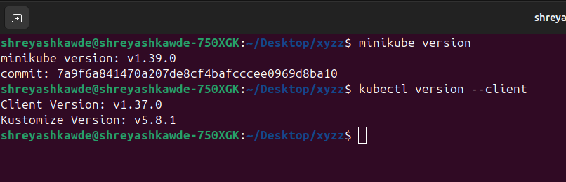
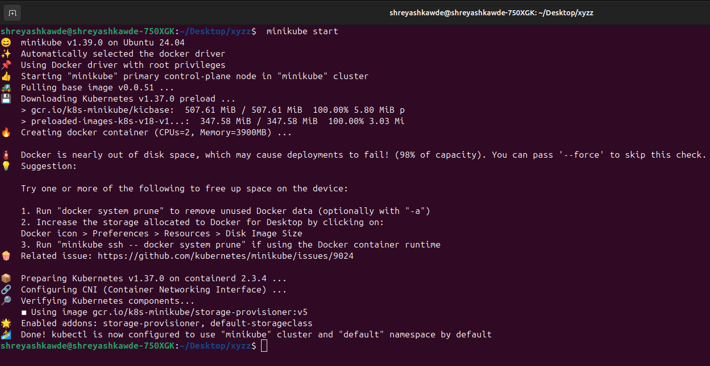
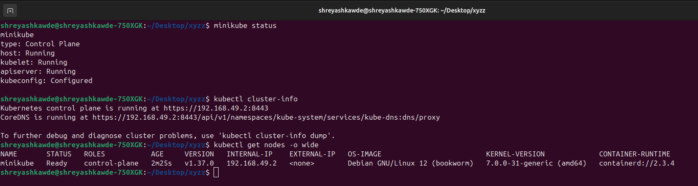
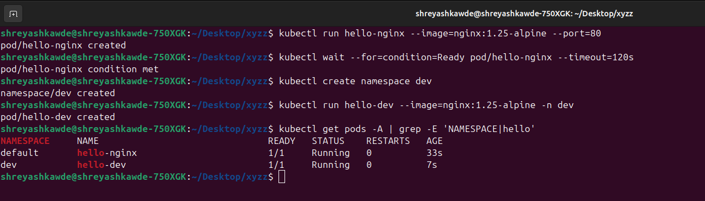
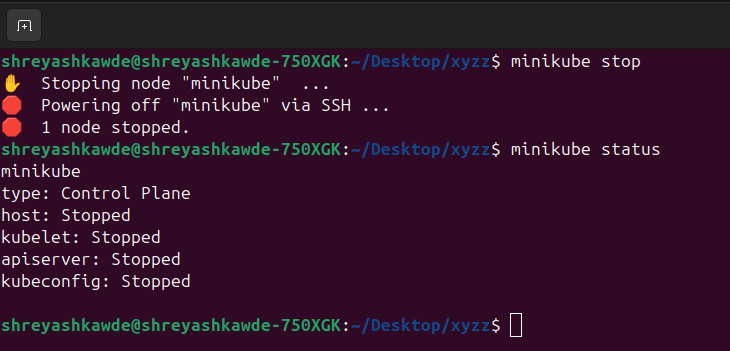

# Kubernetes Fundamentals

**Name:** Shreyash Sukhadev Kawde  
**Enrollment number:** 24BCS10253 
**Class:** Lecture 9

This guide explains how to set up a local cluster. It also covers Kubernetes architecture, Pods, namespaces, and helpful commands for checking the health of your cluster.

## 1. Install and check your tools

`kubectl` is a command-line tool we use to communicate with Kubernetes. Minikube is used to build a small local cluster on your machine, which is great for learning.

If you are using macOS with Homebrew, you can install them like this:

```bash
brew install kubectl minikube
```

Before you begin, make sure both tools are installed correctly:

```bash
minikube version
kubectl version --client
```

What you should see: Both commands will show the version numbers without any errors.

```text
minikube version: vX.Y.Z
Client Version: vX.Y.Z
```



## 2. Start the cluster and verify it

```bash
minikube start
minikube status
kubectl cluster-info
kubectl get nodes -o wide
```

Here is what you need to verify:

- Minikube should show that the host, kubelet, and API server are all running.
- The node status should say `Ready`.
- The command `kubectl cluster-info` should show that it can connect to the control plane and CoreDNS.



The most important thing is that the control plane is reachable and your node is marked as `Ready`.

```text
host: Running
kubelet: Running
apiserver: Running

NAME       STATUS   ROLES           VERSION
minikube   Ready    control-plane   vX.Y.Z
```



## 3. Kubernetes architecture

Kubernetes uses a declarative approach. This means you tell it what you want, and its internal controllers work constantly to make sure the actual state matches what you asked for.

```text
kubectl
   |
   v
+--------------------------- CONTROL PLANE ---------------------------+
| kube-apiserver <----> etcd                                         |
|       |                                                            |
|       +----> kube-scheduler                                        |
|       +----> kube-controller-manager                               |
+----------------------------+----------------------------------------+
                             |
                             v
+--------------------------- WORKER NODE -----------------------------+
| kubelet  |  container runtime  |  kube-proxy  |  application Pods  |
+---------------------------------------------------------------------+
```

| Component | Where it runs | What it does |
|---|---|---|
| `kube-apiserver` | Control plane | This is the main gateway. Tools like `kubectl` talk to its API. |
| `etcd` | Control plane | This database stores the cluster state and all Kubernetes data. |
| `kube-scheduler` | Control plane | It finds the best node to run a newly created Pod. |
| `kube-controller-manager` | Control plane | It runs loops that fix any differences between the current state and what you requested. |
| `kubelet` | Each node | It ensures that the containers assigned to its node are running properly. |
| Container runtime | Each node | The software that actually runs your containers (like `containerd`). |
| `kube-proxy` | Each node when used | It manages network rules for Services so traffic reaches the right Pod. |
| CoreDNS | Cluster add-on | It provides DNS names so Pods and Services can find each other. |

The API server acts as the central hub. Other parts of the system should never talk to `etcd` directly.

To view the system components running in your local cluster, use these commands:

```bash
kubectl get pods -n kube-system -o wide
kubectl get --raw='/readyz?verbose'
```

## 4. Run and inspect your first Pod

A Pod is the smallest thing you can deploy in Kubernetes. Usually, it holds one main application container, but it can also hold extra helper containers.

If you want to quickly test a Pod without saving a YAML file, this command runs NGINX and keeps it alive so you can look at it:

```bash
kubectl run hello-nginx --image=nginx:1.25-alpine --port=80
kubectl wait --for=condition=Ready pod/hello-nginx --timeout=120s
kubectl get pod hello-nginx -o wide
kubectl describe pod hello-nginx
kubectl exec hello-nginx -- nginx -v
kubectl delete pod hello-nginx
```

Because NGINX keeps running, the Pod stays in a `Running` state. If you ran a quick command like `echo` and set `restartPolicy: Never`, it would show as `Completed` instead.



## 5. Working with namespaces

Namespaces help you group and separate resources in a single cluster. Inside a specific namespace, each resource name must be unique.

```bash
kubectl get namespaces
kubectl create namespace dev
kubectl run hello-dev --image=nginx:1.25-alpine -n dev
kubectl get pods -A | grep -E 'NAMESPACE|hello'
kubectl delete namespace dev
```

Here are some standard namespaces you will see:

| Namespace | What it is for |
|---|---|
| `default` | This is where things go if you do not specify a namespace. |
| `kube-system` | Used for internal Kubernetes processes and add-ons. |
| `kube-public` | Stores cluster data that anyone can read (if set up that way). |
| `kube-node-lease` | Holds heartbeat records for nodes to show they are alive. |


## 6. Generate YAML files and check schemas

If you forget how to write a specific field, these commands are very helpful:

```bash
kubectl create deployment web --image=nginx:alpine \
  --dry-run=client -o yaml

kubectl explain pod
kubectl explain pod.spec.containers
kubectl api-resources
```

Adding `--dry-run=client -o yaml` creates a basic YAML template on your screen without actually creating the resource in your cluster.

## 7. Stop or reset Minikube

```bash
minikube stop
minikube status
```

Using `stop` turns off the cluster, but keeps your data so you can restart it later. Using `minikube delete` will completely destroy the cluster. Only use delete if you want a totally fresh start.

What you should see after running `stop`: The host, kubelet, and API server will show as stopped, but the kubeconfig stays configured.

```text
host: Stopped
kubelet: Stopped
apiserver: Stopped
kubeconfig: Configured
```



## 8. Final quick check

```bash
minikube status
kubectl get nodes
kubectl get pods -A
kubectl cluster-info
```

If all four of these commands run successfully, it proves that your local cluster, nodes, system Pods, and API connection are all working fine.
