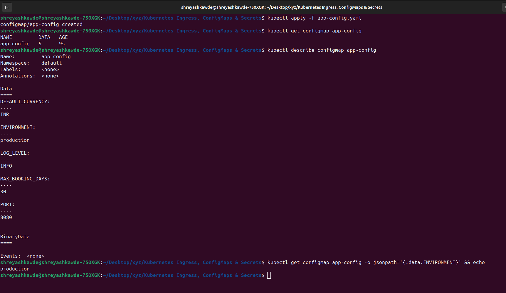
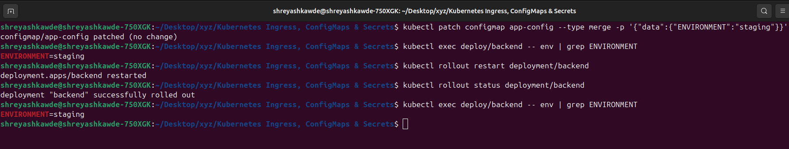
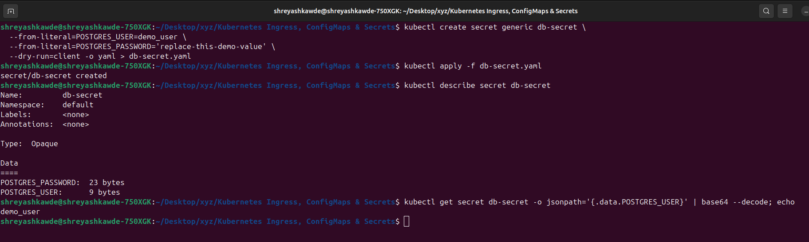
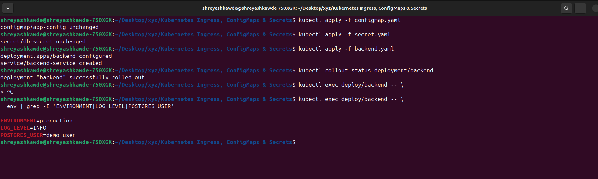
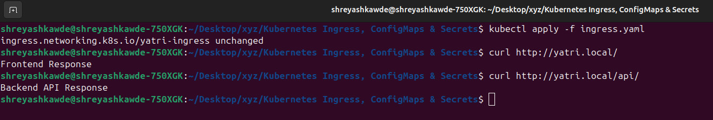
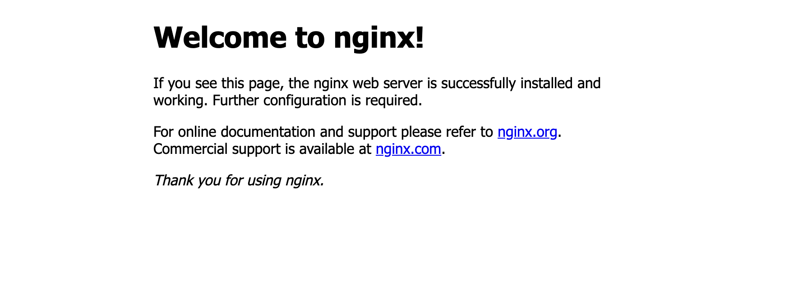
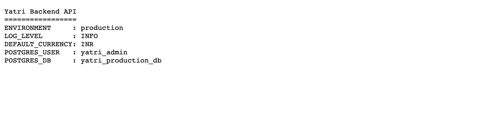
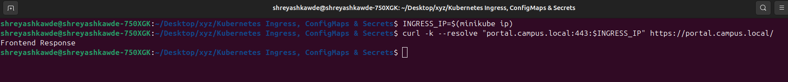
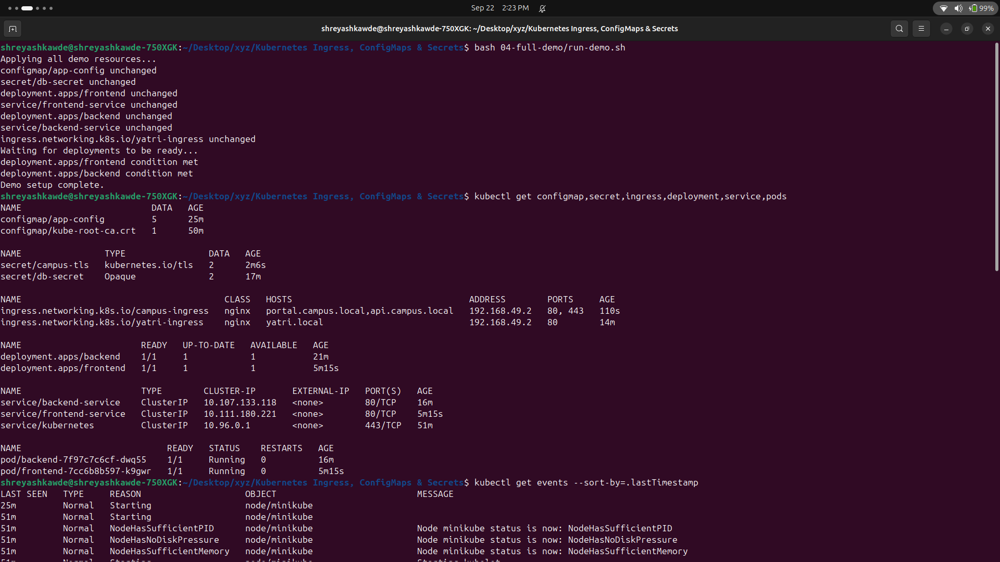
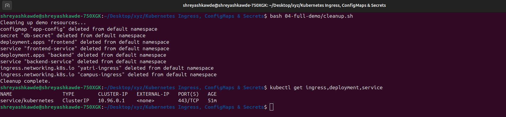

# Kubernetes: Ingress, ConfigMaps, and Secrets

**Name:** Shreyash Sukhadev Kawde 
**Enrollment number:** 24BCS10253
**Class:** Lecture 12

This lab shows how to:
1. Keep configuration separate from your container images.
2. Keep sensitive passwords safe.
3. Route web traffic to different services using one main entry point (Ingress).


---

## 1. Using a ConfigMap for Basic Settings

A ConfigMap holds normal, non-secret settings for your app. 

```yaml
# app-config.yaml
apiVersion: v1
kind: ConfigMap
metadata:
  name: app-config
data:
  ENVIRONMENT: production
  LOG_LEVEL: INFO
  PORT: "8080"
  DEFAULT_CURRENCY: INR
  MAX_BOOKING_DAYS: "30"
```

Apply and check it:
```bash
kubectl apply -f app-config.yaml
kubectl get configmap app-config
kubectl describe configmap app-config
kubectl get configmap app-config -o jsonpath='{.data.ENVIRONMENT}' && echo
```
*ConfigMaps are not encrypted. Don't put passwords in them.*



---

## 2. Updating a ConfigMap

When a container starts, it reads the environment variables. If you change the ConfigMap later, the running container won't automatically see the changes. You have to restart the pod to apply them.

```bash
# Update the ConfigMap to 'staging'
kubectl patch configmap app-config \
  --type merge \
  -p '{"data":{"ENVIRONMENT":"staging"}}'

# Check the old pod (it will still say 'production')
kubectl exec deploy/backend -- env | grep ENVIRONMENT

# Restart the deployment to apply changes
kubectl rollout restart deployment/backend
kubectl rollout status deployment/backend

# Check the new pod (it will now say 'staging')
kubectl exec deploy/backend -- env | grep ENVIRONMENT
```



---

## 3. Creating a Secret (Base64)

Secrets are used for sensitive data. Kubernetes stores them in Base64 format. Base64 is just a simple encoding—it is NOT real encryption!

```bash
kubectl create secret generic db-secret \
  --from-literal=POSTGRES_USER=demo_user \
  --from-literal=POSTGRES_PASSWORD='replace-this-demo-value' \
  --dry-run=client -o yaml > db-secret.yaml

kubectl apply -f db-secret.yaml
kubectl describe secret db-secret

# Decode the username to see it
kubectl get secret db-secret -o jsonpath='{.data.POSTGRES_USER}' | base64 --decode
echo
```



---

## 4. The Newline Mistake

When making secrets manually, the `echo` command adds a hidden newline character at the end. This extra character becomes part of your password and can break your app!

```bash
# See the difference (0a is the newline)
echo "secretpassword" | xxd
echo -n "secretpassword" | xxd

echo "secretpassword" | base64
echo -n "secretpassword" | base64
```
A safer way to encode without newlines is using `printf`:
```bash
printf %s 'secretpassword' | base64
```

---

## 5. Real-World Security Rules

In a real company, you shouldn't keep Base64 secrets in your Git repository because anyone can decode them. Usually, teams use tools like **AWS Secrets Manager**, **Azure Key Vault**, or **HashiCorp Vault**.

**Best Practices:**
- Never commit real passwords to Git.
- Give apps only the specific secrets they need.
- Use Kubernetes RBAC (Role-Based Access Control).
- Encrypt your Kubernetes data store.
- Rotate (change) your passwords regularly.
- Don't print passwords in your logs.

---

## 6. Injecting ConfigMaps and Secrets into an App

Here is how you load both a ConfigMap and a Secret into an application at the same time:

```yaml
# Inside your backend Deployment YAML
envFrom:
  - configMapRef:
      name: app-config
env:
  - name: POSTGRES_USER
    valueFrom:
      secretKeyRef:
        name: db-secret
        key: POSTGRES_USER
```

Apply and check:
```bash
kubectl apply -f configmap.yaml
kubectl apply -f secret.yaml
kubectl apply -f backend.yaml

kubectl rollout status deployment/backend

# Verify the variables are inside the container
kubectl exec deploy/backend -- env | grep -E 'ENVIRONMENT|LOG_LEVEL|POSTGRES_USER'
```
*(We avoid printing the password. Seeing the username is enough to know it worked).*



---

## 7. What is an Ingress?

- **Ingress Resource:** A Kubernetes rule file that tells the cluster how to route traffic (like matching a URL path to a Service).
- **Ingress Controller:** The actual software (like Nginx) that reads those rules and moves the traffic.

*Note: The basic Ingress API is complete, and the Kubernetes community is moving towards the newer "Gateway API" for future features.*

---

## 8. Turning on Minikube Ingress

If you are using Minikube, you need to enable the Ingress addon:

```bash
minikube addons enable ingress
kubectl get pods -n ingress-nginx

# Wait for it to be ready
kubectl wait --namespace ingress-nginx \
  --for=condition=Ready pod \
  --selector=app.kubernetes.io/component=controller \
  --timeout=120s

kubectl get service -n ingress-nginx
```

---

## 9. Setting Up Local Domains

To use custom domain names on your local laptop, you need to edit your `/etc/hosts` file.

1. Get your Minikube IP:
```bash
minikube ip
```
2. Add this line to `/etc/hosts` (requires admin rights):
```text
<minikube-ip> yatri.local portal.campus.local api.campus.local
```

You can test if it works using a custom `Host` header instead:
```bash
curl -H 'Host: yatri.local' http://127.0.0.1:<forwarded-port>/
```

---

## 10. Routing by Path

You can route traffic based on the URL path. For example:
- `yatri.local/` goes to the frontend.
- `yatri.local/api/` goes to the backend.

```bash
kubectl apply -f ingress.yaml
kubectl get ingress
kubectl describe ingress yatri-ingress

curl http://yatri.local/
curl http://yatri.local/api/
```







---

## 11. Routing by Hostname

You can also route traffic based on the domain name:
- `portal.campus.local` goes to the frontend.
- `api.campus.local` goes to the backend.

```bash
INGRESS_IP=$(minikube ip)
curl -H 'Host: portal.campus.local' "http://$INGRESS_IP/"
curl -H 'Host: api.campus.local' "http://$INGRESS_IP/"
```

---

## 12. Hybrid Routing (Host + Path)

You can combine both rules!

```bash
kubectl apply -f ingress-hybrid.yaml
kubectl describe ingress campus-ingress
```
If you get a `404 Not Found`, the route is missing. If you get a `503 Service Unavailable`, the backend service is down.

---

## 13. Adding HTTPS (TLS)

For secure HTTPS traffic, we can make a local self-signed certificate:

```bash
openssl req -x509 -nodes -days 30 -newkey rsa:2048 \
  -keyout tls.key \
  -out tls.crt \
  -subj '/CN=portal.campus.local/O=CampusDevOps' \
  -addext 'subjectAltName=DNS:portal.campus.local,DNS:api.campus.local'

kubectl create secret tls campus-tls \
  --cert=tls.crt \
  --key=tls.key
```

Test the secure connection:
```bash
INGRESS_IP=$(minikube ip)
curl -k --resolve "portal.campus.local:443:$INGRESS_IP" https://portal.campus.local/
```
*(The `-k` flag tells curl to trust our self-signed lab certificate).*



---

## 14. Full Automation Demo

You can run a script to deploy everything at once:

```bash
bash 04-full-demo/run-demo.sh

kubectl get configmap,secret,ingress,deployment,service,pods
kubectl get events --sort-by=.lastTimestamp
```



When you are done, clean everything up:
```bash
bash 04-full-demo/cleanup.sh
kubectl get ingress,deployment,service
```



---

## Troubleshooting Guide

If something isn't working, check things in this order:

```bash
# 1. Are the pods running?
kubectl get pods
kubectl describe pod <pod-name>
kubectl logs <pod-name> --all-containers

# 2. Are the services routing traffic?
kubectl get service
kubectl get endpointslice

# 3. Are the ingress rules correct?
kubectl describe ingress <ingress-name>

# 4. Check for general cluster errors
kubectl get events --sort-by=.lastTimestamp
```
**Troubleshooting Order:** Pod Health ➔ Services & Endpoints ➔ Ingress Rules ➔ DNS/Host mapping.
