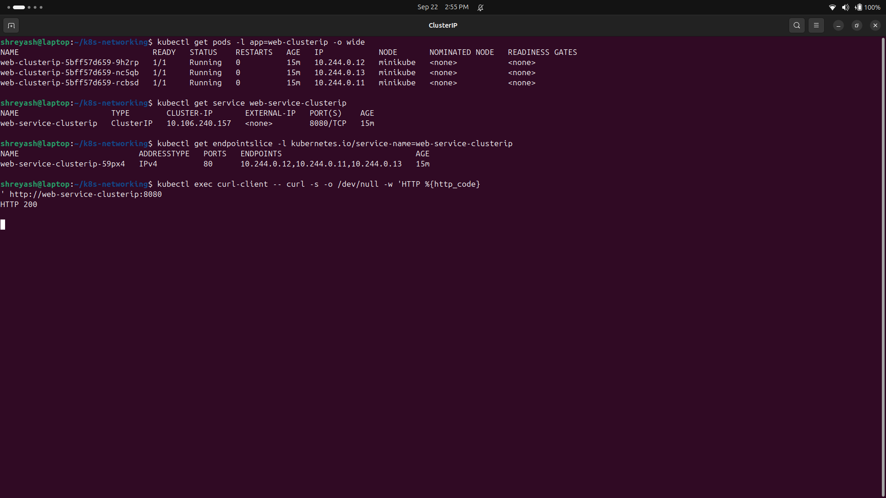
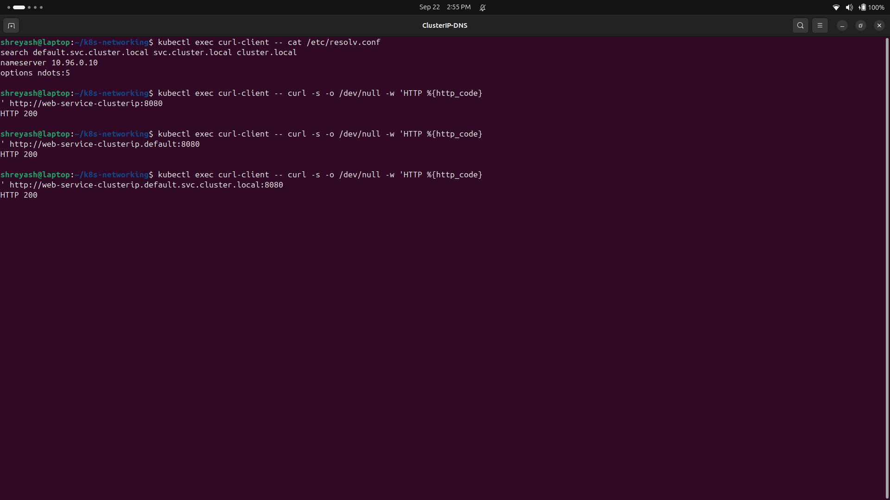
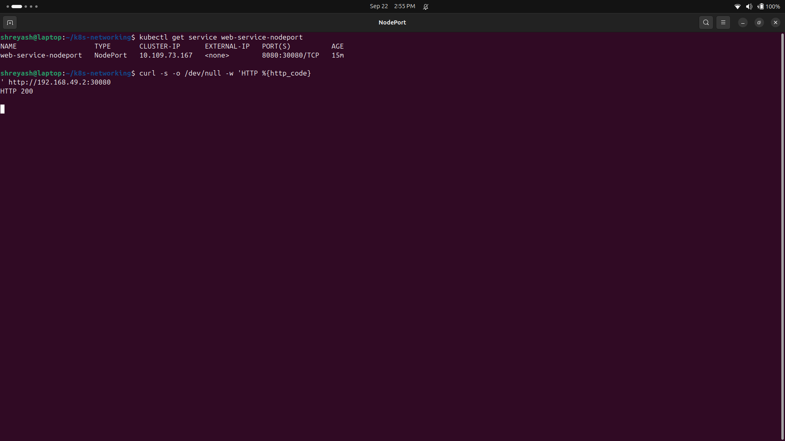
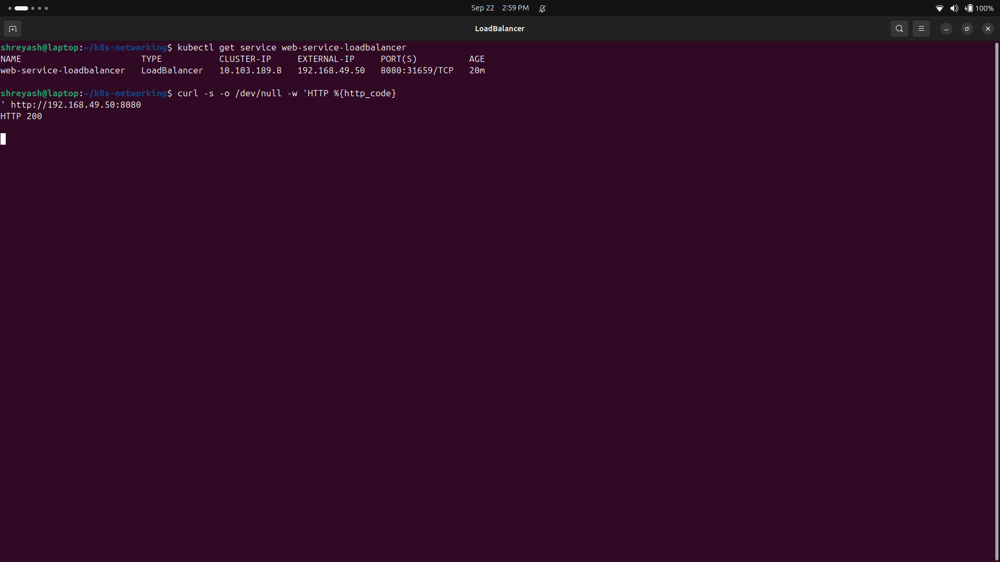
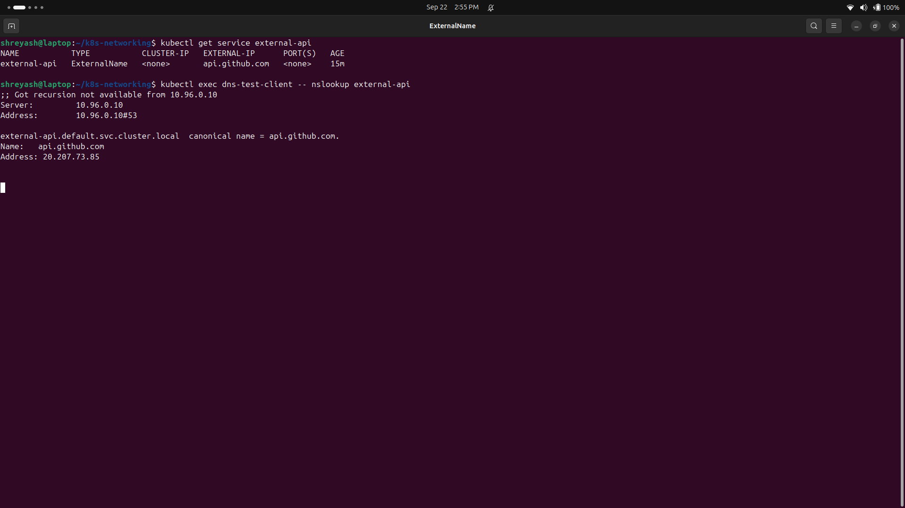
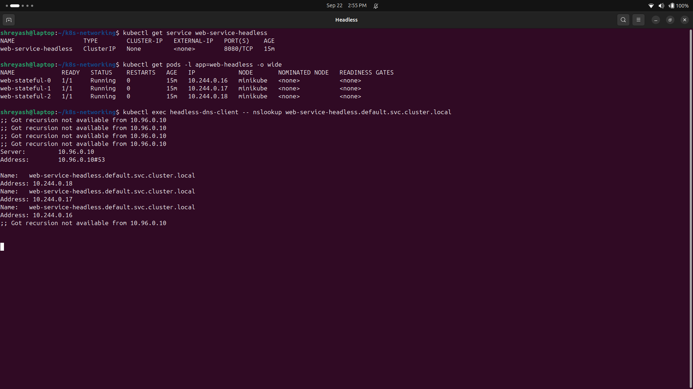
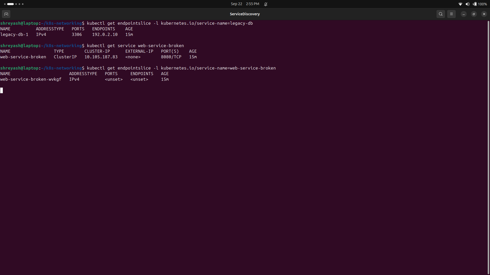

# 🌐 Kubernetes Networking & Services

> Class notes on how Services give Pods a stable address, plus the DNS bits around them.

| | |
|---|---|
| **Name** | Shreyash Sukhadev Kawde |
| **Enrollment number** | 24BCS10253 |
| **Class** | Lecture 11 |

A Pod can die and come back with a new IP address. A **Service** gives clients one stable name and one stable way to reach the healthy Pods behind it. These notes cover the five Service types from class and the DNS around them. IP addresses and generated ports change from cluster to cluster, so yours may look a little different.

---

### 📑 On this page

1. [The four ports](#1-the-four-ports)
2. [ClusterIP](#2-clusterip)
3. [NodePort](#3-nodeport)
4. [LoadBalancer](#4-loadbalancer)
5. [ExternalName](#5-externalname)
6. [Headless Service](#6-headless-service)
7. [Service without a selector](#7-service-without-a-selector)
8. [CoreDNS and FQDN details](#8-coredns-and-fqdn-details)
9. [Deployment identity vs StatefulSet identity](#9-deployment-identity-vs-statefulset-identity)
10. [Deployment, StatefulSet and DaemonSet](#10-deployment-statefulset-and-daemonset)
11. [Picking a Service without wasting load balancers](#11-picking-a-service-without-wasting-load-balancers)
12. [Minikube Docker-driver networking on macOS and Windows](#12-minikube-docker-driver-networking-on-macos-and-windows)
- [Quick comparison](#-quick-comparison)
- [Cleanup](#-cleanup)

---

## 1. The four ports

> **In one line:** a request hops through four ports before it reaches your app.

Here is the path I use to remember them:

```text
outside client
      |
      v
nodeIP:nodePort -> ServiceIP:port -> PodIP:targetPort -> application
                                                        (containerPort documents it)
```

| Field | Where it lives | What it does |
|---|---|---|
| `containerPort` | Pod template | Just a note that the app listens on port `80`. It does not open traffic on its own. |
| `targetPort` | Service backend | Sends the Service's traffic to port `80` on a chosen Pod. |
| `port` | Service | The port clients use to call the Service, for example `8080`. |
| `nodePort` | Cluster node | A high port (usually `30000-32767`) opened on the node for a NodePort Service. |

```yaml
ports:
  - port: 8080
    targetPort: 80
    nodePort: 30080
```

So the full path is `node:30080 -> Service:8080 -> Pod:80`.

---

## 2. ClusterIP

> **In one line:** the default type, for traffic inside the cluster only.

`ClusterIP` is the default Service type. It is meant for talking inside the cluster. From my laptop I usually cannot reach it directly.

```bash
kubectl apply -f 01-clusterip/
kubectl get pods -l app=web-clusterip -o wide
kubectl get service web-service-clusterip
kubectl get endpointslice \
  -l kubernetes.io/service-name=web-service-clusterip

kubectl exec curl-client -- \
  curl -s http://web-service-clusterip:8080
```

The Service selector must match the Pod labels. If they do not match, the Service still exists, but its EndpointSlice has no ready Pods behind it.



### DNS names

You can reach the same Service by any of these names:

```text
web-service-clusterip
web-service-clusterip.default
web-service-clusterip.default.svc.cluster.local
```

The full pattern is:

```text
<service>.<namespace>.svc.<cluster-domain>
```



---

## 3. NodePort

> **In one line:** ClusterIP plus the same open port on every node.

NodePort is built on top of ClusterIP. It opens one port on every node.

```bash
kubectl apply -f 02-nodeport/
kubectl get service web-service-nodeport
minikube service web-service-nodeport --url
```

On a Linux node you can reach directly, the address is:

```text
http://<node-ip>:30080
```



---

## 4. LoadBalancer

> **In one line:** ask an outside system for a public address; still ClusterIP underneath.

`LoadBalancer` asks an outside system, usually a cloud provider, to give the Service an outside address. Under the hood it still has ClusterIP behaviour and usually a NodePort too.

```bash
kubectl apply -f 03-loadbalancer/
kubectl get service web-service-loadbalancer -w
```

On Minikube the external IP stays `<pending>` until something plays the part of the cloud load balancer. Two common local ways are the built-in tunnel (needs root) or the MetalLB addon, which gives out addresses from a pool:

```bash
# Option A: minikube tunnel (keep running in another terminal, needs sudo)
minikube tunnel

# Option B: MetalLB addon giving addresses from the node's network range
minikube addons enable metallb
minikube addons configure metallb   # pool e.g. 192.168.49.50-192.168.49.70

kubectl get service web-service-loadbalancer
```

If it stays `<pending>` on a local cluster, it usually means nothing is there to answer the request: no cloud load-balancer controller and no local stand-in.

The screenshot below was made on this Linux host with the MetalLB addon. The Service got a real `EXTERNAL-IP` (`192.168.49.50`) from the pool and replied on port `8080`.



---

## 5. ExternalName

> **In one line:** a DNS alias to a name that lives outside Kubernetes.

ExternalName makes a DNS alias to a name outside Kubernetes. It has no selector, no ClusterIP and no Pod endpoints.

```yaml
apiVersion: v1
kind: Service
metadata:
  name: external-api
spec:
  type: ExternalName
  externalName: api.github.com
```

```bash
kubectl apply -f 04-externalname/
kubectl get service external-api
kubectl exec dns-test-client -- nslookup external-api
```

DNS should show a CNAME chain. HTTP or HTTPS may still need the right `Host` header and TLS name, so an ExternalName is not a general proxy.



---

## 6. Headless Service

> **In one line:** no virtual IP; DNS hands back the real Pod IPs.

A headless Service sets `clusterIP: None`. DNS then returns the IPs of the ready Pods, one by one, instead of one Service IP. This helps when clients need to find specific StatefulSet replicas.

```bash
kubectl apply -f 05-headless/
kubectl rollout status statefulset/web-stateful
kubectl get service web-service-headless
kubectl get pods -l app=web-headless -o wide

kubectl exec headless-dns-client -- \
  nslookup web-service-headless.default.svc.cluster.local

kubectl exec headless-dns-client -- \
  nslookup web-stateful-0.web-service-headless.default.svc.cluster.local
```



---

## 7. Service without a selector

> **In one line:** point a Service at a backend that Kubernetes does not run.

A Service with no selector can stand for a backend that Kubernetes does not manage, like a legacy database. On current Kubernetes I should make an `EndpointSlice`; the old `Endpoints` object is deprecated.

```yaml
apiVersion: v1
kind: Service
metadata:
  name: legacy-db
spec:
  ports:
    - name: mysql
      port: 3306
      targetPort: 3306
---
apiVersion: discovery.k8s.io/v1
kind: EndpointSlice
metadata:
  name: legacy-db-1
  labels:
    kubernetes.io/service-name: legacy-db
addressType: IPv4
ports:
  - name: mysql
    protocol: TCP
    port: 3306
endpoints:
  - addresses: ["192.0.2.10"]
```

`192.0.2.10` is only an example address for docs. A real lab must use a backend you can actually reach, and must not point at some random private machine.

```bash
kubectl get endpointslice \
  -l kubernetes.io/service-name=legacy-db
```

The next screenshot shows the matching failure case: a normal Service whose selector matched no Pods.



---

## 8. CoreDNS and FQDN details

> **In one line:** the search list turns short names into full cluster names.

```bash
kubectl get pods -n kube-system -l k8s-app=kube-dns
kubectl exec curl-client -- cat /etc/resolv.conf
kubectl exec curl-client -- nslookup web-service-clusterip
kubectl exec curl-client -- \
  nslookup web-service-clusterip.default.svc.cluster.local
```

A Pod usually gets settings like this:

```text
nameserver 10.96.0.10
search default.svc.cluster.local svc.cluster.local cluster.local
options ndots:5
```

The search list lets a short name grow into a full cluster name. With `ndots:5`, names with fewer than five dots may be tried against the search suffixes first. That can add extra DNS lookups for outside names, so I should check the resolver's real settings before claiming it is slow, not just assume it.

---

## 9. Deployment identity vs StatefulSet identity

> **In one line:** Deployments get new random names; StatefulSets keep their number.

```bash
kubectl get pods -l app=web-clusterip
kubectl get pods -l app=web-headless

kubectl delete pod <one-deployment-pod>
kubectl delete pod web-stateful-0
kubectl get pods -w
```

- A Deployment's replacement gets a new random Pod name.
- A StatefulSet's replacement keeps the same numbered name, `web-stateful-0`.
- Stable identity does not mean the Pod never restarts. It means the controller brings back that same numbered identity.

---

## 10. Deployment, StatefulSet and DaemonSet

> **In one line:** pick by identity and storage needs, not by habit.

| Point | Deployment | StatefulSet | DaemonSet |
|---|---|---|---|
| Best for | Stateless APIs and websites | Databases and clustered systems | Node-level agents |
| Pod identity | Throwaway random names | Stable numbered names | One Pod per matching node |
| Startup order | Usually all at once | In order by default | All at once across nodes |
| Storage | Shared or throwaway volumes | Usually one PVC per number | Often node-local or `hostPath` |
| Networking | Normal Service | Usually headless Service for stable Pod DNS | Often no Service at all |
| Scaling | Set the replica count | Scale up/down in order | Follows the number of matching nodes |

---

## 11. Picking a Service without wasting load balancers

> **In one line:** many HTTP apps can share one gateway instead of one load balancer each.

```text
Only needed inside the cluster?
  |-- ordinary app -> ClusterIP
  `-- direct StatefulSet Pod discovery -> Headless Service

Need to refer to an outside DNS name?
  `-- ExternalName, after checking DNS/TLS behavior

Need outside traffic?
  |-- local practice -> NodePort or port-forward
  |-- one TCP/UDP service -> LoadBalancer when appropriate
  `-- many HTTP services -> one Gateway/Ingress entry point + ClusterIP backends
```

Making one cloud load balancer for every HTTP microservice adds cost and opens more public doors. One shared Layer 7 gateway can send traffic by hostname or path to the internal ClusterIP Services.

The class estimate used `$25` per load balancer per month. With that number, 50 separate load balancers cost `50 x $25 = $1,250/month`; one shared entry point costs `$25/month`, so the example saving is `$1,225/month`. This is just class maths, not a real cloud quote. Real prices depend on provider, region, hours, size and traffic, so I would check the provider's calculator before trusting a production number.

---

## 12. Minikube Docker-driver networking on macOS and Windows

> **In one line:** on Mac/Windows the node hides inside Docker, so you need a tunnel.

With the Docker driver, the Minikube node can sit inside its own Docker network. The node IP may not be reachable from the host.

For NodePort:

```bash
minikube service web-service-nodeport --url
```

Keep that command running if it opens a local tunnel, then test the printed `127.0.0.1` URL from another terminal.

For LoadBalancer:

```bash
minikube tunnel
```

Then check the external address with:

```bash
kubectl get service web-service-loadbalancer
```

This is a limit of the local driver, not a fault in the Kubernetes Service itself.

---

## 📊 Quick comparison

| Type | ClusterIP | Outside access | Main use |
|---|---:|---:|---|
| ClusterIP | Yes | No by default | Internal application traffic |
| NodePort | Yes | Node IP and high port | Development or simple on-prem access |
| LoadBalancer | Yes | External implementation | Managed external entry point |
| ExternalName | No | DNS alias only | Stable in-cluster name for outside DNS |
| Headless | `None` | No virtual IP | Direct Pod discovery |

---

## 🧹 Cleanup

```bash
kubectl delete -f 05-headless/
kubectl delete -f 04-externalname/
kubectl delete -f 03-loadbalancer/
kubectl delete -f 02-nodeport/
kubectl delete -f 01-clusterip/
```
