# Kubernetes Pods, ReplicaSets & Deployments

Name: Shreyash Sukhadev Kawde
Enrollment number: 24BCS10253
Class: Lecture 10

This class is about two things. How Kubernetes keeps an app running, and how it
swaps one version of an app for another one. I wrote the notes in the same order
as the class tasks, so it is easy to follow later.

---

## 1) First check that the cluster is fine

```bash
minikube start
kubectl version --output=yaml
kubectl cluster-info
kubectl get nodes -o wide
kubectl get pods -n kube-system
```

I only move ahead when the node says `Ready` and CoreDNS is running. If I skip
this and the cluster is unhealthy, the errors later look like YAML mistakes. But
the YAML is fine and the cluster was the real problem. That wasted my time once.

---

## 2) A single Pod on its own

Every manifest has four main fields at the top.

```yaml
apiVersion: v1
kind: Pod
metadata:
  name: nginx-pod
  labels:
    app: nginx
spec:
  containers:
    - name: nginx
      image: nginx:alpine
      ports:
        - containerPort: 80
```

```bash
kubectl apply -f pod.yml
kubectl wait --for=condition=Ready pod/nginx-pod --timeout=120s
kubectl get pod nginx-pod -o wide --show-labels
kubectl logs nginx-pod
kubectl describe pod nginx-pod
kubectl delete pod nginx-pod
```

A plain Pod does not repair itself. I delete it and nothing brings it back,
because no controller is watching it.

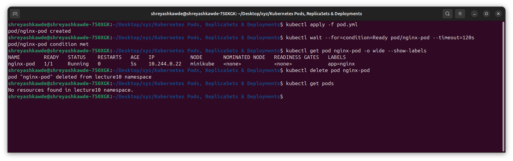

---

## 3) ErrImagePull and ImagePullBackOff

A wrong image name still passes the API checks. So the Pod object gets saved
without any complaint. The failure comes later, when kubelet asks the container
runtime to pull that image.

```bash
kubectl apply -f broken-image.yaml
kubectl get pods -w
kubectl describe pod broken-image-pod
kubectl get events --sort-by=.metadata.creationTimestamp
```

The order is normally this:

```text
Pending -> ErrImagePull -> ImagePullBackOff
```

`ImagePullBackOff` just means Kubernetes is trying again, and waiting a bit
longer before each try. The useful error is near the bottom of
`kubectl describe pod`, not at the top.

What I should see: the Pod moves from `ErrImagePull` to `ImagePullBackOff`, and
the Events part says which image could not be pulled.

```text
NAME               READY   STATUS             RESTARTS
broken-image-pod   0/1     ImagePullBackOff   0
```

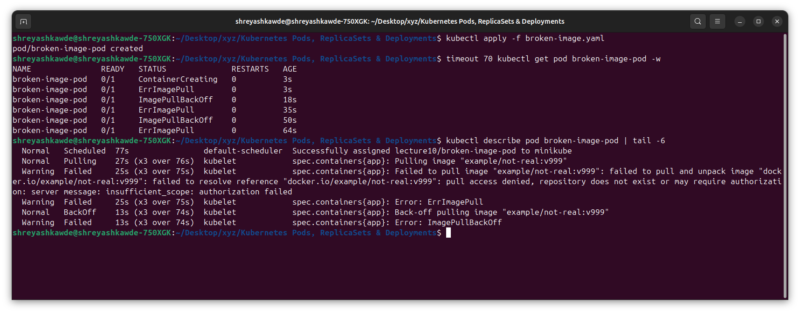

---

## 4) A Pod that finishes and stops

This is an easy way to see a batch Pod that works correctly.

```yaml
apiVersion: v1
kind: Pod
metadata:
  name: hello
spec:
  restartPolicy: Never
  containers:
    - name: hello
      image: busybox:1.36
      command: ["sh", "-c", "echo hello; sleep 5"]
```

Apply it, then watch it fast from another terminal.

```bash
kubectl apply -f hello.yml
kubectl get pod hello -w
kubectl logs hello
```

On screen the status goes `ContainerCreating`, then `Running`, then `Completed`.
Inside Kubernetes the real phase behind `Completed` is `Succeeded`. The two names
are for the same thing.

---

## 5) Pod lifecycle and probes lab

There are 12 example files. They cover four ideas only: scheduling, how a process
exits, health checks, and Pods that hold more than one container.

| File | What it shows | What I look at |
|---|---|---|
| `01-running.yaml` | A healthy process that keeps running | `Running`, `Ready 1/1` |
| `02-pending.yaml` | Pod cannot be placed, usually because it asks for too much CPU or memory | `Pending` and scheduler events |
| `03-succeeded.yaml` | Process exits with code 0 and `restartPolicy: Never` | Phase `Succeeded`, shown as `Completed` |
| `04-failed.yaml` | Process exits with a code that is not 0 | Phase `Failed` |
| `05-crashloopbackoff.yaml` | Process keeps crashing and keeps getting restarted | Restart count and backoff events |
| `06-imagepullbackoff.yaml` | Image cannot be downloaded | Pull error in events |
| `07-readiness.yaml` | Container runs, but is not ready for traffic yet | `Running` but `READY 0/1` |
| `08-liveness.yaml` | Kubelet restarts a container that is unhealthy | Restart count goes up |
| `09-startup.yaml` | A slow app gets extra time before other probes start | Startup probe passes first |
| `10-init-container.yaml` | Setup containers run in order before the app | `Init:` status and init logs |
| `11-multi-container.yaml` | Containers in one Pod share network and volumes | Both containers in one Pod |
| `12-termination.yaml` | Clean shutdown after `SIGTERM` | Termination message and grace period |

```bash
kubectl apply -f pod-lifecycle/
kubectl get pods -w
kubectl describe pod <pod-name>
kubectl logs <pod-name> -c <container-name>
kubectl get events --sort-by=.lastTimestamp
```

The three probes are easy to mix up, so this is the short version.

| Probe | The question it asks | What happens if it fails |
|---|---|---|
| Startup | Has this slow app finished starting? | Other probes wait. If it keeps failing, the container is restarted. |
| Readiness | Can this Pod take traffic right now? | Pod keeps running, but it is removed from the Service endpoints. |
| Liveness | Is this process stuck or broken? | Kubelet restarts the container. |

The main things worth comparing are the restart count going up for
`CrashLoopBackOff`, `READY 0/1` when the readiness probe fails, and a clean
shutdown message during graceful termination.

```text
lifecycle-crashloop     0/1   CrashLoopBackOff
lifecycle-readiness     0/1   Running
lifecycle-termination   1/1   Terminating
```

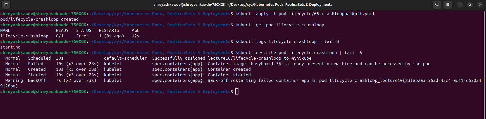

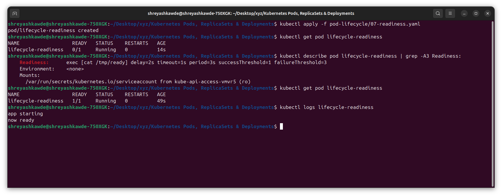

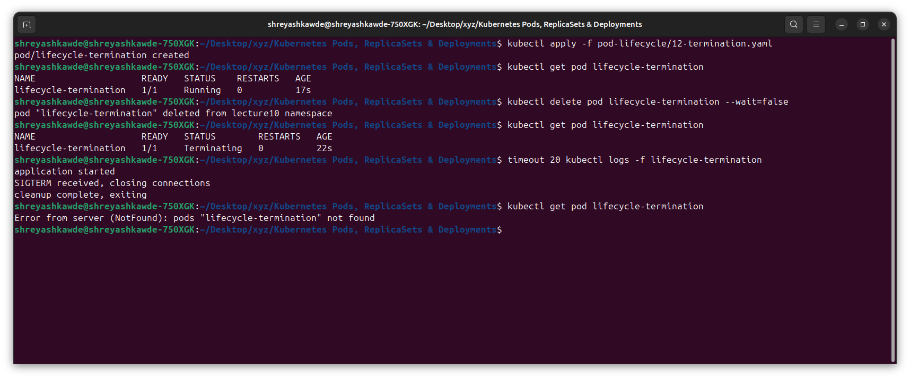

---

## 6) ReplicaSet and StatefulSet

### ReplicaSet

A ReplicaSet keeps a fixed number of matching Pods alive. Labels are the link
between the Pods and the controller.

```bash
kubectl apply -f replicaset.yml
kubectl get rs
kubectl get pods --show-labels
kubectl delete pod <one-replicaset-pod>
kubectl get pods -w
```

If I delete one Pod, the ReplicaSet should build a new one, so the count comes
back to what I asked for.

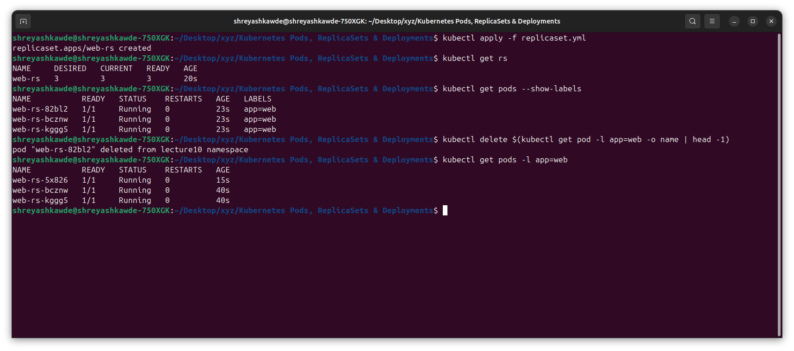

### StatefulSet

A StatefulSet is for apps that need a fixed name, a fixed start order, or their
own storage that stays with them.

```bash
kubectl apply -f statefulset.yml
kubectl rollout status statefulset/mysql
kubectl get pods -l app=mysql
kubectl get pvc
```

The names are numbered, like `mysql-0` and `mysql-1`. If I delete `mysql-0`, the
new Pod is called `mysql-0` again. Its storage claim also stays tied to that same
name. This is the big difference from a ReplicaSet, where names are random.

---

## 7) DaemonSet

A DaemonSet runs one copy of a Pod on every node that allows it. It is used for
node exporters, log agents and security agents.

```bash
kubectl apply -f daemonset/node-agent-ds.yaml
kubectl get daemonset
kubectl get pods -l app=node-agent -o wide
kubectl get nodes
```

There is no normal `replicas` field here. If a new node joins the cluster, a
DaemonSet Pod starts on it by itself. Nobody has to change the count.

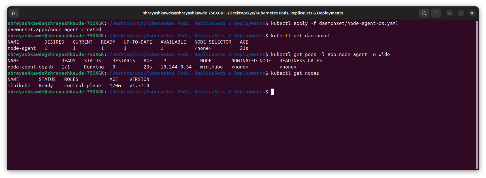

---

## 8) Deployment, rolling update and rollback

A Deployment manages ReplicaSets. That one extra layer is what gives us rollout
history, controlled updates and rollback.

```bash
kubectl apply -f deployment/deployment-v1.yaml
kubectl rollout status deployment/app
kubectl get deploy,rs,pods

kubectl apply -f deployment/deployment-v2.yaml
kubectl rollout status deployment/app
kubectl rollout history deployment/app

kubectl rollout undo deployment/app
kubectl rollout status deployment/app
```

For a rolling update with no downtime:

```yaml
strategy:
  type: RollingUpdate
  rollingUpdate:
    maxSurge: 1
    maxUnavailable: 0
```

`maxSurge: 1` lets one extra Pod run above the count I asked for, while the
update is going on. `maxUnavailable: 0` keeps all the wanted Pods available
before any old Pod is removed. If I write these as percentages, they are counted
from the wanted replica count. `maxSurge` rounds up and `maxUnavailable` rounds
down.

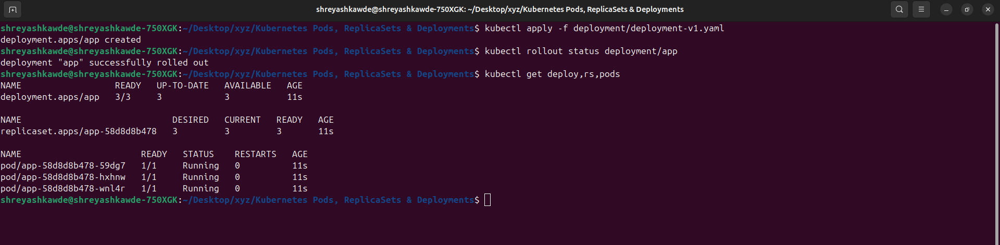

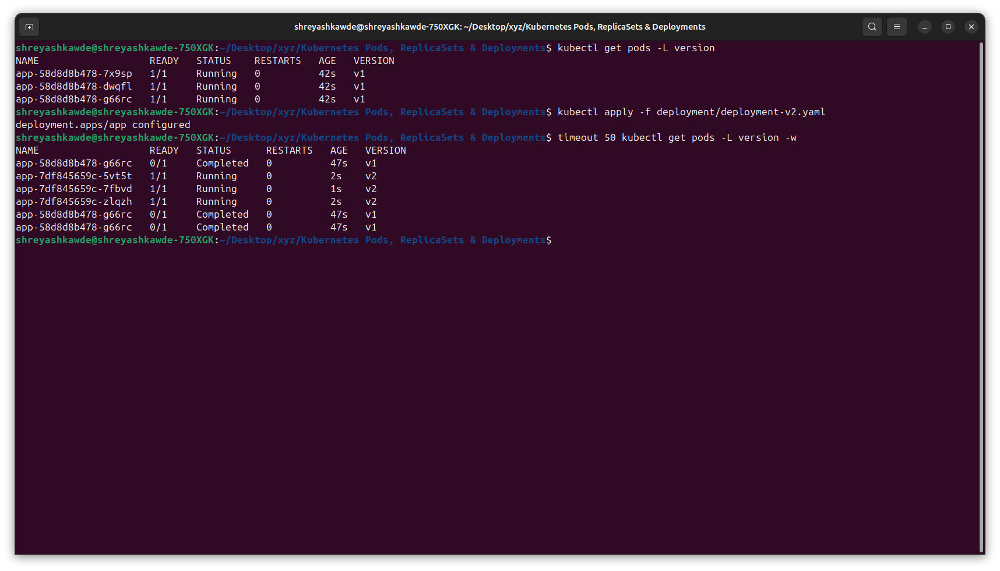

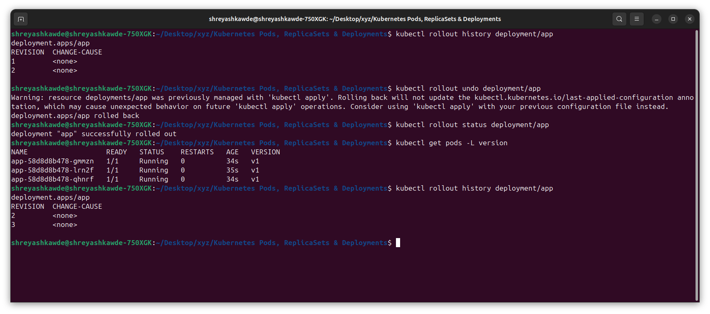

---

## 9) Two things that go wrong

### A broken image during an update

```bash
kubectl set image deployment/app app=example/not-real:v999
kubectl rollout status deployment/app --timeout=60s
kubectl get pods
kubectl describe pod <new-broken-pod>
kubectl rollout undo deployment/app
```

This one is nice to see. With a safe rolling strategy the old healthy Pods keep
serving traffic while the new ReplicaSet is stuck and going nowhere.

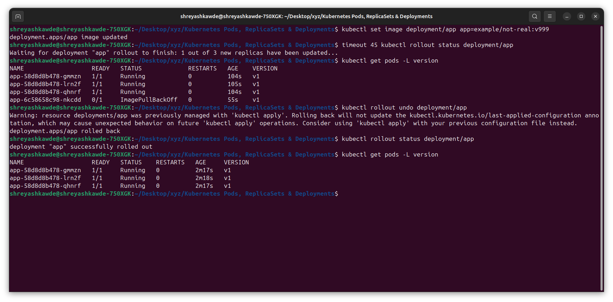

### Selector does not match

The labels under `spec.selector.matchLabels` have to match the labels in the Pod
template. If they do not match, the API says no. That makes sense, because the
Deployment would not know which Pods belong to it.

```bash
kubectl apply -f selector-mismatch.yaml
kubectl get events --sort-by=.lastTimestamp
```

So the file has to be fixed before creating the Deployment. A Deployment selector
cannot be changed after it is created. Changing it later usually means deleting
the Deployment and making it again.

---

## 10) Things I kept mixing up

### The four port names

| Field | What it means |
|---|---|
| `containerPort` | Just written down for information. It is the port the process uses inside the container. It does not open the Pod by itself. |
| `targetPort` | The Pod port that a Service sends traffic to. |
| `port` | The port that clients use on the Service. |
| `nodePort` | A high port opened on every node for a NodePort Service. |

### Labels and selectors

Labels are simple key and value tags put on objects. Selectors are the queries
that controllers and Services use to find objects that carry those labels. One is
the tag, the other is the search.

```bash
kubectl get pods -l app=web
kubectl get pods --show-labels
```

### Requests and limits

| Setting | What it means |
|---|---|
| CPU request | Used by the scheduler when it picks a node. |
| Memory request | Memory kept aside so the scheduler can decide. |
| CPU limit | Above this limit the CPU usage is slowed down. |
| Memory limit | Going above this can get the container `OOMKilled`. |

One more small thing. `1Gi` is 1,073,741,824 bytes and `1G` is 1,000,000,000
bytes. They look similar but they are not the same number.

---

## 11) Blue-green deployment

Blue-green keeps two complete environments running at the same time.

```text
Service selector: slot=blue  -> Blue v1 Pods
Service selector: slot=green -> Green v2 Pods
```

```bash
kubectl apply -f 02-blue-green/deployment-blue.yaml
kubectl apply -f 02-blue-green/deployment-green.yaml
kubectl apply -f 02-blue-green/service-blue.yaml
kubectl get endpointslice -l kubernetes.io/service-name=app-service

# Cut over to green
kubectl apply -f 02-blue-green/service-green.yaml

# Roll back immediately
kubectl apply -f 02-blue-green/service-blue.yaml
```

The switch is fast because only the Service selector changes. Nothing is built or
pulled at that moment. The cost is that both versions have to run together, so it
needs about double the resources.

What I should see: the selector changes from `slot=blue` to `slot=green`, and the
EndpointSlice now points at the green Pods.

```text
Before cutover: selector slot=blue
After cutover:  selector slot=green
```

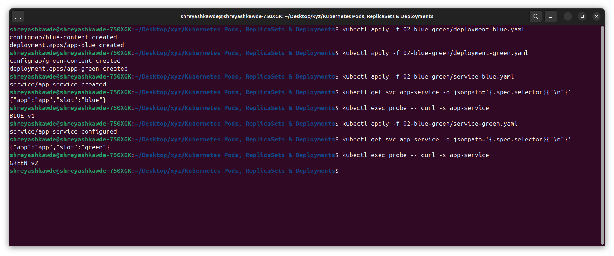

---

## 12) Canary deployment

Canary sends the new version to a small part of the traffic first. With a normal
Service the split is only a rough guess. It depends on how many ready endpoints
there are, nothing else.

```bash
kubectl apply -f 03-canary/deployment-stable.yaml
kubectl apply -f 03-canary/deployment-canary.yaml
kubectl apply -f 03-canary/service.yaml

kubectl scale deployment app-stable --replicas=9
kubectl scale deployment app-canary --replicas=1
kubectl get endpointslice -l kubernetes.io/service-name=app-service

# Send the sample from inside the cluster, so the Service ClusterIP does the balancing.
kubectl run probe --image=nicolaka/netshoot --restart=Never --command -- sleep 3600
kubectl wait --for=condition=Ready pod/probe --timeout=180s
for i in $(seq 20); do kubectl exec probe -- curl -s app-service; done

# Increase the canary share, or abort it
kubectl scale deployment app-stable --replicas=7
kubectl scale deployment app-canary --replicas=3
kubectl scale deployment app-canary --replicas=0
```

A 9 to 1 Pod ratio does not give exactly 90:10 traffic in a small sample. My run
came out closer to 85:15. For real weight control, a service mesh or a gateway
that understands traffic is the better choice.

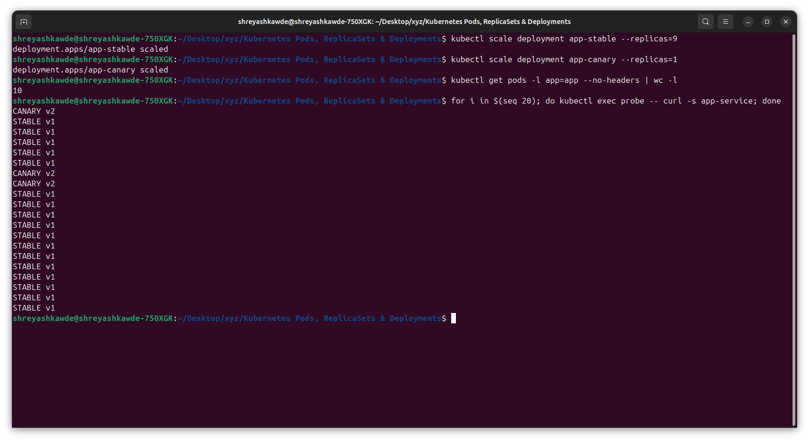

What I should see: most replies come from the stable version and a few come from
the canary one. The exact ratio is different every time.

```text
STABLE v1
STABLE v1
CANARY v2
STABLE v1
```

---

## 13) Recreate deployment

`Recreate` stops all the old Pods first, and only then starts the new ones. It is
the simplest strategy, but it gives a real downtime window.

```yaml
strategy:
  type: Recreate
```

```bash
kubectl apply -f 04-recreate/deployment-v1.yaml
kubectl apply -f 04-recreate/service.yaml
kubectl rollout status deployment/app-recreate

# Probe from inside the cluster so the requests survive every Pod being replaced.
kubectl run probe --image=nicolaka/netshoot --restart=Never --command -- sleep 3600
kubectl wait --for=condition=Ready pod/probe --timeout=180s

# Start the probe loop in the background, then trigger the update.
for i in $(seq 40); do kubectl exec probe -- curl -s -m1 app-recreate 2>/dev/null || echo '[OUTAGE] no ready Pod'; done &
kubectl apply -f 04-recreate/deployment-v2.yaml
```

What I should see: replies show v1, then fail for a short time while the old Pods
are being removed, then show v2.

```text
Application v1
[OUTAGE] no ready Pod
Application v2
```

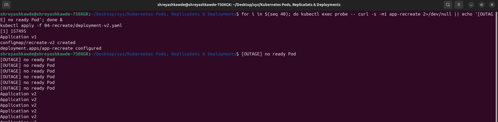

---

## All four strategies together

| Strategy | Downtime | Extra capacity | How traffic moves | Where it fits |
|---|---|---|---|---|
| Rolling update | Normally none | A small surge | Pods are swapped slowly, a few at a time | The default choice for a normal stateless app |
| Blue-green | None during the switch | About two full environments | All traffic moves at once when the selector changes | When a fast cutover and fast rollback matter |
| Canary | None | Small at the start | Only a small group gets the new version | Releases where the risk has to stay low |
| Recreate | Yes | None | Old version stops first, then the new one starts | Versions that cannot run together, or single-writer apps |

---

## Cleanup

Delete only what was made for the lab, nothing else.

```bash
kubectl delete -f <lab-directory>
kubectl get all
```
