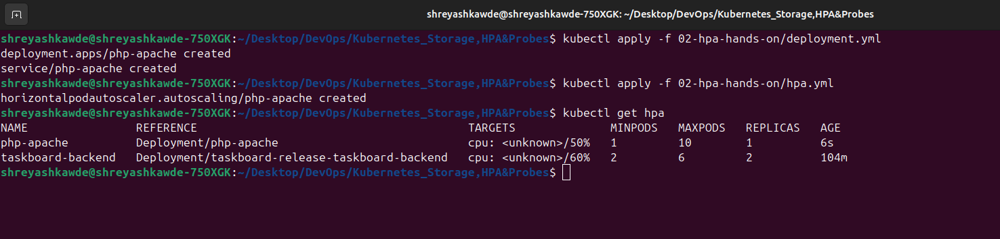
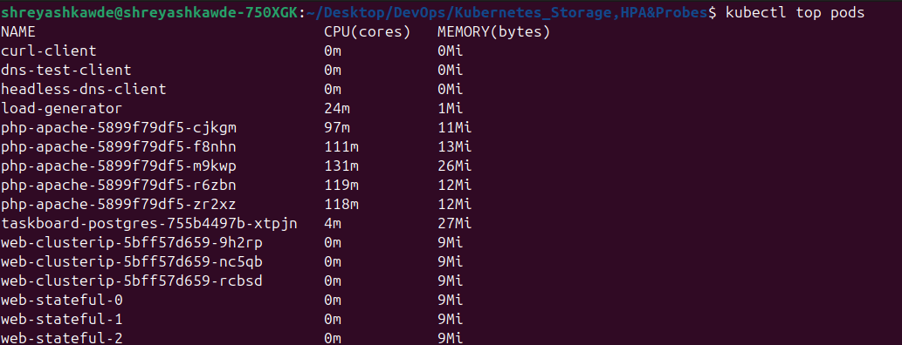
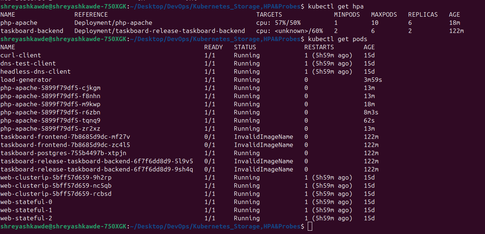
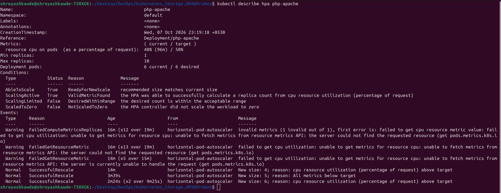

# Session 13: Kubernetes Storage, HPA & Probes Homework

This repository contains my homework for Session 13. I have completed all three tasks assigned for this session.

## Task 1: Kubernetes Volumes

I have created a dedicated folder `01-kubernetes-volumes` which contains documentation on different types of Kubernetes volumes. It includes simple explanations and practical YAML examples for:
* emptyDir
* hostPath
* PersistentVolume
* PersistentVolumeClaim
* StorageClass
* Dynamic provisioning

You can check it out here: [Volumes Documentation](./01-kubernetes-volumes/README.md)

---

## Task 2: HPA Hands-on

For this task, I deployed an application, configured a Horizontal Pod Autoscaler (HPA), and tested it using a load generator.

The files used for this task are in the `02-hpa-hands-on` directory:
- `deployment.yml`: The main application deployment (php-apache) and service.
- `hpa.yml`: The HPA configuration targeting 50% CPU utilization.
- `load_generator.sh`: A script to generate traffic and increase load on the application.

### Steps to Reproduce and Verify:

1. **Deploy the application:**
   ```bash
   kubectl apply -f 02-hpa-hands-on/deployment.yml
   ```
2. **Configure HPA:**
   ```bash
   kubectl apply -f 02-hpa-hands-on/hpa.yml
   ```
3. **Verify HPA (Initial state):**
   ```bash
   kubectl get hpa
   ```
   *(Note for me: Take a screenshot of `kubectl get hpa` here showing the initial state before load)*
   
   <kbd></kbd>

4. **Deploy the load generator and Increase application load:**
   Run the load generator script in a separate terminal to keep it running:
   ```bash
   ./02-hpa-hands-on/load_generator.sh
   ```

5. **Observe CPU utilization and Pod scaling:**
   Watch the HPA and Pods as the load increases:
   ```bash
   kubectl get hpa -w
   kubectl top pods
   kubectl get pods
   ```
   *(Note for me: Take a screenshot of `kubectl top pods` showing high CPU usage)*
   
   <kbd></kbd>
   
   *(Note for me: Take a screenshot of `kubectl get hpa` and `kubectl get pods` showing the replicas scaling up)*
   
   <kbd></kbd>

6. **Check HPA Description:**
   ```bash
   kubectl describe hpa php-apache
   ```
   *(Note for me: Take a screenshot of the `describe hpa` output showing the events)*
   
   <kbd></kbd>

---

## Task 3: Mini Project

I have completed the mini-project for Session 13. All the required implementation files are located in the `03-mini-project` directory.

The mini-project includes:
- A dedicated Namespace (`production-webapp`)
- Persistent Volume Claim (`pvc.yaml`) for storage persistence
- Deployment (`deployment.yaml`) with probes (Startup, Readiness, Liveness)
- Service (`service.yaml`) for exposure
- HPA (`hpa.yaml`) for auto-scaling

You can deploy the whole project using:
```bash
kubectl apply -f 03-mini-project/namespace.yaml
kubectl apply -f 03-mini-project/pvc.yaml
kubectl apply -f 03-mini-project/deployment.yaml
kubectl apply -f 03-mini-project/service.yaml
kubectl apply -f 03-mini-project/hpa.yaml
```

Please see the [Mini-Project README](./03-mini-project/README.md) for detailed verification steps.
