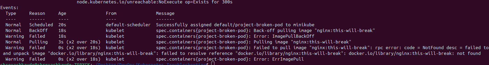
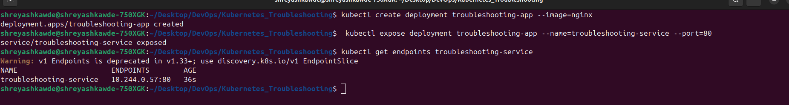

# Kubernetes Troubleshooting Mini-Project

## Task 1 & 2: Kubernetes Commands & Common Issues

During this session, I practiced troubleshooting commands like `kubectl get`, `kubectl describe`, `kubectl logs`, `kubectl exec`, `kubectl get events`, `kubectl explain`, `kubectl top`, and `kubectl get -o wide`.

I also investigated common Kubernetes issues:
- **CrashLoopBackOff**: The container keeps crashing after starting. I used `kubectl logs` to see what the application output was.
- **ImagePullBackOff**: Kubernetes couldn't download the image. I used `kubectl describe pod` to find out if the image name was misspelled.
- **Pending**: The pod was waiting to be assigned to a node. I used `kubectl describe pod` to look at the events and see if there was a lack of CPU or memory.
- **Service & DNS issues**: Pods were running but couldn't talk to each other. I checked `kubectl get endpoints` to make sure the service mapped to the pods correctly.

---

## Task 3: Mini Project

### 1. Broken Pod Troubleshooting

I applied a broken pod deployment and it failed to start. 

**Investigation Steps:**
1. Ran `kubectl get pod project-broken-pod` and saw the status was stuck.
2. Ran `kubectl describe pod project-broken-pod` and checked the Events at the bottom to see what Kubernetes was trying to do.

**Answers to Questions:**
- **Question 1:** What is the Pod status?
  - *Answer:* It was in `ImagePullBackOff` or `ErrImagePull` state.
- **Question 2:** What is the actual error?
  - *Answer:* It failed to pull the image because the image tag didn't exist or was invalid.
- **Question 3:** Which command helped you find the reason?
  - *Answer:* I used `kubectl describe pod project-broken-pod` and looked at the events.
- **Question 4:** What is wrong with the image?
  - *Answer:* The image name/tag had a typo.
- **Question 5:** How would you fix it?
  - *Answer:* I would edit the pod YAML file to use a valid image name (like `nginx:latest`) and run `kubectl apply -f broken-pod.yaml` again.

**Solution:**
I updated the image name in the YAML file to a working image and reapplied it. 

**Before/After Output:**
- **Before:** `project-broken-pod   0/1   ImagePullBackOff   0   2m`
- **After:** `project-broken-pod   1/1   Running            0   10s`

---

### 2. Service Troubleshooting

Next, the application was running, but we couldn't connect through the Service.

**Investigation Steps:**
1. Ran `kubectl get service troubleshooting-service`.
2. Ran `kubectl get endpoints troubleshooting-service` and noticed it returned `<none>`.
3. Ran `kubectl get pods --show-labels` to see what labels the running pods actually had.
4. Ran `kubectl describe service troubleshooting-service` to check its selector.

**Root Cause:**
The service was looking for pods with the label `app: wrong-app`, but the actual pods had the label `app: troubleshooting-app`. The selector didn't match.

**Solution:**
I changed the selector in the Service YAML to `app: troubleshooting-app` and applied it.

**Before/After Output:**
- **Before endpoints:** `troubleshooting-service   <none>` 
- **After endpoints:** `troubleshooting-service   10.244.1.5:80` (IPs of the running pods appeared)

---

### Troubleshooting Table

| Problem | What I Saw | Command I Used | Root Cause | Fix |
| :--- | :--- | :--- | :--- | :--- |
| **Broken Pod** | `ImagePullBackOff` | `kubectl describe pod project-broken-pod` | Typo in the image name | Correct the image tag in YAML and reapply |
| **Service Problem** | Endpoints were `<none>` | `kubectl get endpoints`, `kubectl describe svc` | Selector labels did not match pod labels | Update the Service selector to match pod labels |
| **Image Problem** | `ErrImagePull` | `kubectl describe pod <pod-name>` | Docker image cannot be downloaded | Fix image name or check repository access |

---

## README Questions

1. **What does `kubectl get` tell us?**
   It gives a quick, one-line summary of our resources (like if a pod is Running or Pending).
2. **What is the difference between `get` and `describe`?**
   `get` shows basic status, while `describe` provides deep details like configurations, current state, and recent events.
3. **Why do we use `kubectl logs`?**
   To check the terminal output (stdout/stderr) of the application running inside the container. It helps see app crashes.
4. **When would you use `kubectl exec`?**
   When I want to run commands inside a running container, for example, to use `curl` to test network connectivity from inside.
5. **What does `CrashLoopBackOff` mean?**
   The application container started, but it crashed. Kubernetes keeps trying to restart it, but it keeps crashing.
6. **What does `ImagePullBackOff` mean?**
   Kubernetes is failing to pull the container image and has backed off, meaning it will try again later with increasing delays.
7. **Why can a Pod remain `Pending`?**
   Usually, it's because the cluster doesn't have enough resources (CPU or memory) to schedule the pod on any node.
8. **Why can a Service have no endpoints?**
   Because the Service's `selector` doesn't match the labels of any running pods.
9. **What is the relationship between a Service selector and Pod labels?**
   The Service uses its selector to find Pods with identical labels. Those Pods are then added as endpoints for the Service.
10. **What is Kubernetes DNS?**
    It's an internal system (like CoreDNS) that allows pods and services to find each other using names (like `troubleshooting-service`) instead of hard-to-remember IP addresses.
