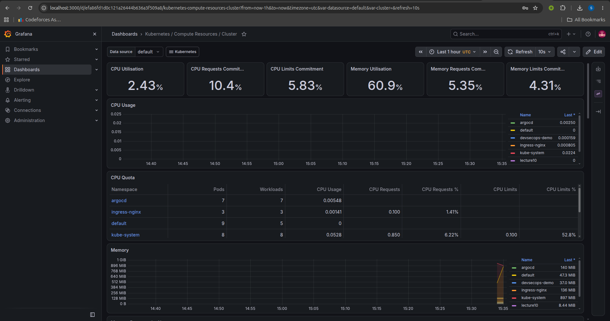
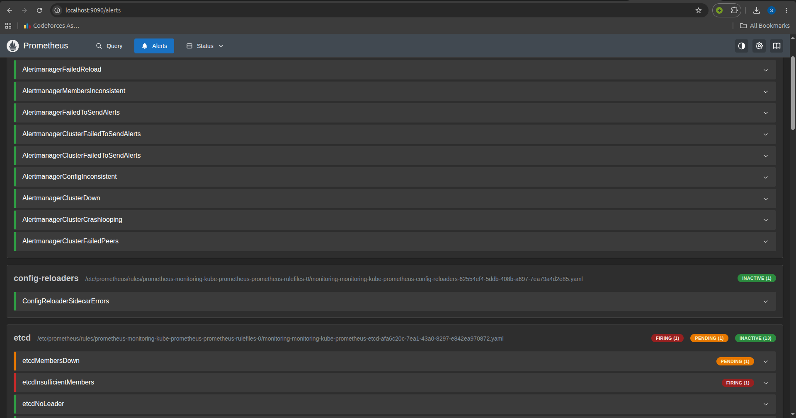
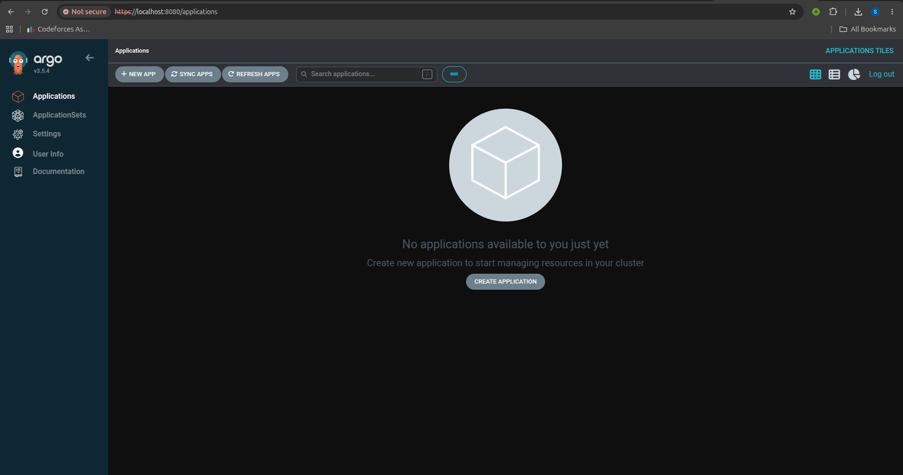

# Session 20: Monitoring, Observability & GitOps

This is my homework for Session 20. It covers Monitoring, Observability, and GitOps.

## Task 1: Monitoring Demo

In this task, we looked at how to monitor our applications and servers.

- **Metrics**: Numbers that measure the system, like how many requests per second we get.
- **Logs**: Text records of what happened in the system (like error messages).
- **Alerts**: Notifications that tell us when something is wrong (like if CPU is over 90%).
- **CPU & Memory Utilization**: We monitored how much CPU and RAM the servers are using to make sure they are not overloaded.
- **Application health**: We checked if our app is up and running properly.

### Monitoring Dashboard

### Alerts Configured

## Task 2: Observability Documentation

Observability helps us understand what is happening inside our system by looking at the outside outputs.

### The Three Major Pillars:
1. **Metrics**: These are numbers measured over a period of time. They help us see the overall health of the system.
2. **Logs**: These are detailed records of events. If a metric tells us there is a problem, logs help us find exactly what caused it.
3. **Traces**: These track a request from start to finish as it moves through different services. It helps us find where a request is getting slow or failing.

### Why is observability required?
It is required so we can quickly find and fix problems. When systems become complex (like with microservices), it is hard to know what broke. Observability gives us the data to debug issues fast.

### Common Tools
- Prometheus (for metrics)
- Grafana (for dashboards and visualizing metrics)
- ELK stack / Loki (for logs)
- Jaeger / Tempo (for traces)

### Kubernetes Observability
In Kubernetes, we have many small containers running across different nodes. It is very important to collect metrics, logs, and traces from all nodes and pods so we can see the whole picture of the cluster. Tools like Prometheus and Grafana are standard for Kubernetes.

## Task 3: GitOps Demo

### What is GitOps?
GitOps is a way to manage infrastructure and applications using Git.

- **Git as the source of truth**: All our configuration files are stored in Git. If it's not in Git, it shouldn't be in the cluster.
- **Declarative configuration**: We write down *what* we want the system to look like (e.g., "run 3 pods"), not *how* to do it.
- **Continuous reconciliation**: A software agent keeps checking Git. If the cluster doesn't match Git, the agent automatically updates the cluster to match Git.
- **GitOps workflow**: 
  1. We push code or config changes to Git.
  2. The GitOps agent (like ArgoCD) detects the change.
  3. The agent automatically applies the changes to the Kubernetes cluster.
- **Kubernetes + GitOps**: Kubernetes is perfect for GitOps because it works with declarative YAML files. Tools like ArgoCD or Flux run inside Kubernetes and pull changes directly from the Git repository.

### GitOps in Action

