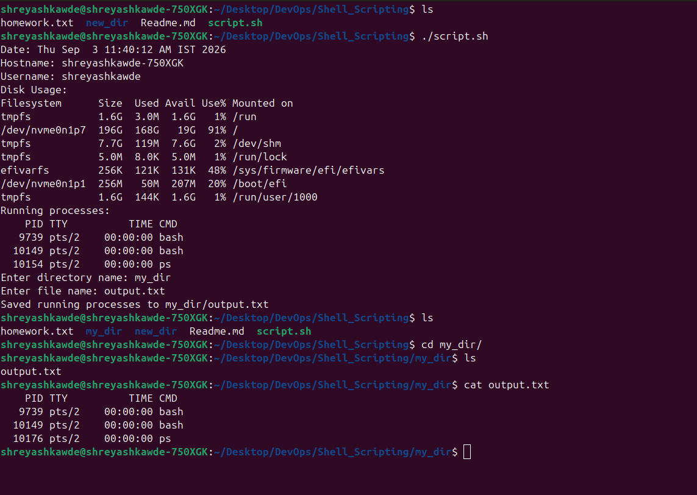

# Shell Scripting Homework

This repository contains a shell script `script.sh` that retrieves system information, takes user input to create a directory and file, and saves the currently running processes to that file.

## Script Details
The script performs the following tasks as required:
- Prints the current date.
- Prints the hostname.
- Prints the username.
- Prints the disk usage.
- Creates a directory from user input using `mkdir`.
- Creates a file from user input using `touch`.
- Stores the running processes in the file using `> output redirection`.

## Output Screenshot

