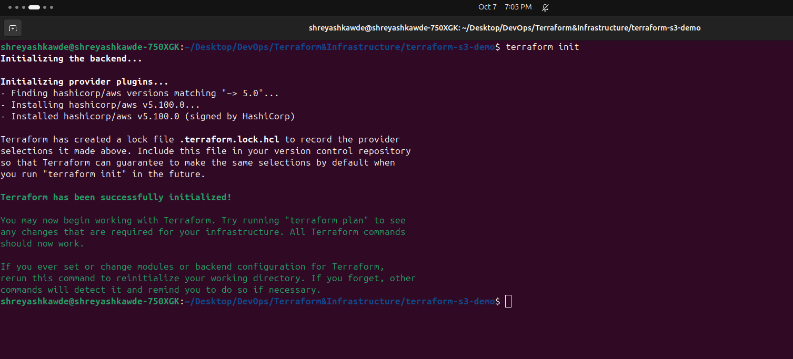
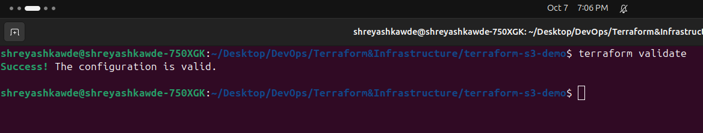
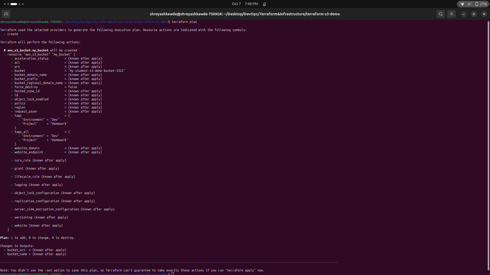
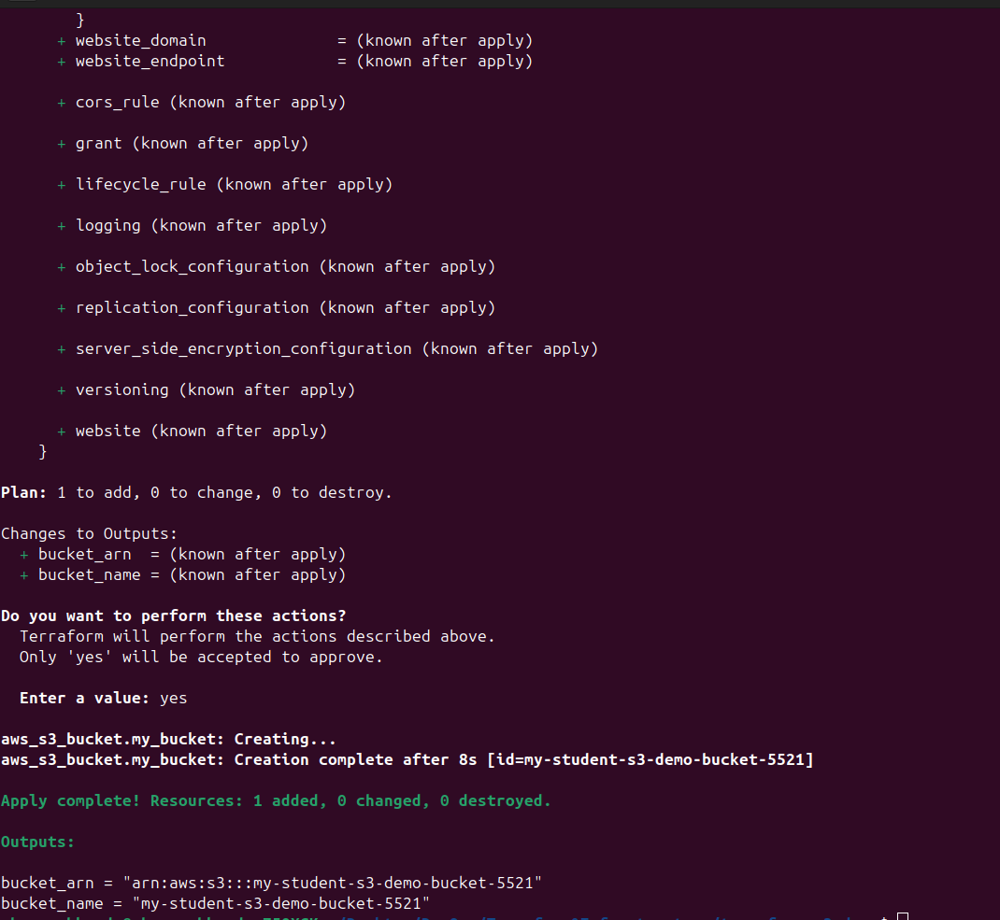
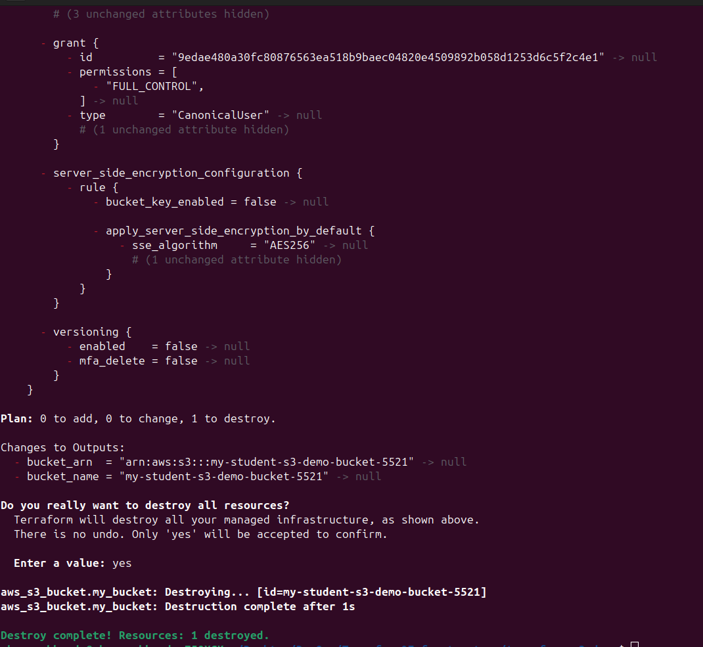

# Terraform S3 Bucket Demo

This is my homework for creating an AWS S3 bucket using Terraform. 

## Files in this project
- `provider.tf`: Tells Terraform we are using AWS.
- `variables.tf`: Lists the variables we need (like region and bucket name).
- `terraform.tfvars`: Sets the actual values for our variables.
- `main.tf`: The main file that creates the S3 bucket.
- `outputs.tf`: Shows the bucket name and ARN after it gets created.

## How I ran this

1. **Initialize Terraform**
   This downloads the AWS provider plugin so Terraform can talk to AWS.
   ```bash
   terraform init
   ```
   

2. **Format Code**
   This makes sure the code is formatted nicely and properly indented.
   ```bash
   terraform fmt
   ```

3. **Validate Code**
   This checks if there are any syntax errors in the code.
   ```bash
   terraform validate
   ```
   

4. **See the Plan**
   This shows what Terraform is going to create before it actually does it.
   ```bash
   terraform plan
   ```
   

5. **Apply the Plan**
   This actually creates the S3 bucket in AWS. You have to type `yes` to confirm.
   ```bash
   terraform apply
   ```
   

6. **Check State**
   Shows the current state of resources that Terraform knows about.
   ```bash
   terraform show
   ```

7. **See Outputs**
   Prints just the output values (the bucket name and ARN).
   ```bash
   terraform output
   ```

8. **Clean Up**
   Deletes the bucket so we don't get charged for it!
   ```bash
   terraform destroy
   ```
   
